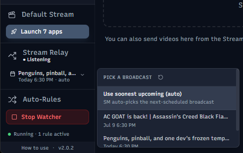

#  Stream Manager

**Website:** [stream-manager.app](https://stream-manager.app/) · **Discord:** [Join the community](https://discord.gg/ufMSh9d8hu)

[](https://opensource.org/licenses/MIT)
[](https://github.com/pjmdesi/stream-manager/releases/latest)
[](https://github.com/pjmdesi/stream-manager/releases)
[](https://github.com/pjmdesi/stream-manager#)

A desktop app that's the central hub for your stream sessions: organize your local recordings, edit and publish your YouTube/Twitch metadata, clip and create thumbnails, and even route your broadcast live. Windows only for now; contributions welcome.

## Mission

Stream Manager is designed to be the central hub for everything pre- and post-stream. It organizes your raw files, metadata, clips, and workflow in one place so you can spend less time wrangling files and more time creating content. If used in the recommended way, you should never have to open your file explorer again to manage your stream-related files.

## Who this is for

- Streamers who record and store their streams locally and want a better way to manage those files and related metadata.
- Streamers who stream to YouTube and/or Twitch and want an easier way to keep their stream metadata in sync with their local files.
- Streamers who go live to YouTube and want the app to bind and transition their broadcast automatically when they start and stop their encoder.
- Streamers who want a built-in tool for clipping and thumbnail creation without needing to use separate apps like Premiere, DaVinci, HandBrake, Photoshop, Affinity, etc.
- Streamers who want to automate parts of their workflow, like moving files from a recording folder to their main stream library, launching all their streaming apps at once, and archiving old streams with consistent encoding settings and tagging.


---

- [Stream Manager](#stream-manager)
  - [Mission](#mission)
  - [Getting Started (as a user)](#getting-started-as-a-user)
  - [Recommended Workflow](#recommended-workflow)
  - [Features](#features)
    - [Streams](#streams)
    - [Stream Relay](#stream-relay)
    - [Video Player](#video-player)
    - [Thumbnail Editor](#thumbnail-editor)
    - [Converter](#converter)
    - [Auto-Rules](#auto-rules)
    - [Launcher](#launcher)
    - [Integrations](#integrations)
      - [YouTube](#youtube)
      - [Twitch](#twitch)
      - [Claude AI](#claude-ai)
  - [Getting Started (as a dev)](#getting-started-as-a-dev)
    - [Prerequisites](#prerequisites)
    - [Install \& run](#install--run)
    - [Build portable executable (Windows)](#build-portable-executable-windows)
  - [Tech Stack](#tech-stack)
  - [Project Structure](#project-structure)
  - [License](#license)

---

## Getting Started (as a user)

**Before starting:** Stream Manager requires consistent naming of files that must include the stream date (preferably as the first part of the filename). Without that, the app has no way to automatically detect and organize them. The default OBS naming format (`YYYY-MM-DD HH-MM-SS`) is recommended and works out of the box. Other formats are not officially supported but may still work.

1. Download the latest release for Windows from the [Releases](https://github.com/pjmdesi/stream-manager/releases) page.
2. Extract the ZIP file and run `StreamManager.exe`.  
_No installation required, runs from anywhere, can be moved freely. Stream Manager's data (settings) is stored on your machine in AppData. Stream item data is stored next to your stream files_
3. Select your main "Streams" folder where your recordings are stored when prompted.
4. The app **scans the folder and auto-detects your structure** and pre-selects the right structure mode. You can change this mode as well:
   - flat folder-per-stream: **recommended**
   - "dump"-folder (all files loose with no subfolders): **not recommended, some app features disabled**  
   _You can choose to convert an existing **dump** folder structure to **folder-per-stream** format during setup, or in Settings._
5. The app will scan the folder for video files, thumbnails, and other related files. Then it will group them into stream items. Click on a stream item to view and edit its metadata.
6. (Optional) Set up an auto-rule to watch your streaming software's recording output folder and automatically move/rename new files to your main "Streams" folder. This is recommended for the smoothest experience.
7. (Optional) Connect the app to YouTube and/or Twitch to enable metadata synchronization for your streams (title, description, tags, thumbnail, etc.). YouTube users can also enable the **Stream Relay**, which automatically takes your broadcast live and ends it when you start and stop your encoder.

---

## Recommended Workflow

1. Before you stream, click the "New Stream" button and fill in the details.

   
2. Set your streaming software to save to a **recordings folder**. This is important if you use cloud-sync software like those for a NAS, OneDrive, or Google Drive to backup your streams. In OBS, this is done in **Settings → Output → Recording → Recording Path**.  

    > _⚠️ **Important:** Recording directly to a cloud-synced folder can cause encoding errors and ruin recordings (in my experience). As Stream Manager manages your files, it detects and adapts to cloud-synced storage._

     
   
3. Set up an auto-rule in the app to watch that **recordings folder** and move/rename new files to your main **Streams** folder (the app will help you set this up during onboarding).

    
4. _(Optional)_ If you've set up the **Stream Relay**, point your streaming software at the app instead of YouTube directly, and it binds your scheduled broadcast, takes it live when your encoder connects, and ends it when you stop.
5. _**Stream your heart out!**_
6. After your stream, the app will automatically organize your recordings. Find the session in the Streams page and optionally add any missing info like the topics/games, stream type, and personal comments.
7. Review the recording in the built-in player and export clips for sharing on social media or YouTube, or send the whole session to the converter to compress it for other uses like archiving or uploading to other services.

---

## How this is built

Stream Manager is built with substantial assistance from Claude (Anthropic's AI assistant) and GitHub Copilot. I'm a front-end developer by trade with a cursory understanding of backend systems; building a full Electron desktop app with multi-track video processing, ffmpeg integration, OAuth flows, and cloud-aware file handling is outside my normal scope and would take years to learn. If you want to see an example of a fully hand-coded application of mine, see [ClpChk](https://github.com/pjmdesi/clp-chk-react).  
Claude is used heavily for architecture, implementation, debugging, code cleanup, and documentation through months of iterative back-and-forth. The product direction, UX decisions, feature scope, testing, and final calls on what is shipped are mine. If you're curious about my take on AI-assisted development, I'm happy to discuss in issues or Discord.

---

## Features

Stream Manager is built around keeping everything about your stream sessions in one place: the recording, metadata, clips, and publishing destinations all collected and organized.

### Streams


The main hub for browsing and managing local recordings of your stream sessions. Video files, thumbnails, and other related assets in your designated folder are scanned and grouped automatically:

- **Two-way YouTube & Twitch sync:** push title, description, tags, thumbnail, and privacy to a linked broadcast or video; pull platform changes back; per-field out-of-sync indicators show exactly what differs between the app and the platform so nothing changes silently.
- **Import & bulk-link from YouTube:** turn your existing channel videos into stream items (details + thumbnail), or match existing local folders to their YouTube videos by date.
- **Custom tagging and metadata:** games/topics, stream type, and freeform comments per session.
- **Episode series tracking:** seasons with auto-incrementing episodes; `{season}`, `{episode}`, `{total_episodes}` merge fields for titles and descriptions; clone a stream as the next episode to carry its settings forward.
- **Reusable templates:** build titles, descriptions, and tags from merge fields (`{game}`, `{title}`, `{season_links}`, …) for consistency across a series. Save and edit them in the built-in editor.
- **Archive processing:** compress and tag old sessions with consistent encoding.
- **Cloud-sync aware:** files offloaded by Synology Drive, OneDrive, Dropbox, Google Drive, etc. are detected; offload to free local space or pin local in bulk via the Windows Cloud Files API.

**Metadata** is stored in a single `_meta.json` file at the root of your streams directory, so stream info is maintained and validated separately from the files themselves allowing easy movement of your library and the location of the app.

**LLM-assisted metadata:** with a Claude API key configured in Integrations, press **Ctrl+Space** in any YouTube title, description, or tags field to get an inline AI suggestion at the cursor (Tab to accept, Esc to dismiss), drawing on the stream's date, games, and type tags for context.

### Stream Relay



The app can sit between your streaming software and YouTube as a local relay, managing your broadcast's lifecycle for you instead of you doing it by hand in YouTube Studio. Point your encoder (OBS, etc.) at the app's local ingest instead of YouTube directly, and it forwards the stream to YouTube using your channel's stream key.

- **Automatic go-live and end:** the moment your encoder connects, the app binds the chosen broadcast and takes it live; when you stop, it ends the broadcast after a short grace period, so a momentary encoder drop-and-reconnect doesn't kill your stream.
- **Broadcast selection:** pick which upcoming broadcast to route to, or let the app auto-select the soonest-scheduled one. Live status, bitrate, and elapsed time show in a sidebar widget.
- **Works without a scheduled broadcast:** go live without picking one and your stream still reaches YouTube; it just isn't auto-managed.
- **Post-stream Twitch update:** when a relay session ends, the app can roll your Twitch channel's title and category forward to your next scheduled broadcast automatically.

_Running the relay adds negligible overhead: it forwards your already-encoded stream data straight through to YouTube without re-encoding, so there's no second encode and no meaningful extra CPU/GPU load beyond your existing encoder._

### Video Player


Open your stream videos and clips (or drop in any video file) and play them back with thumbnail and waveform tracks. Review, clip, and export stream sessions with precision:

- **Multi-track audio:** recordings with multiple audio tracks (game, mic, Discord, etc.) get per-track mute, solo, and volume; the export modal lets you choose which tracks land in the mix.
- **Clip mode:** export a polished clip straight from the player using your default Clip Export Preset. Clips stay linked to their source and are one click from being branched into a new draft, so the original always stays intact.
- **Shape-aware cropping:** set the aspect ratio per segment to repurpose the same highlight as a widescreen, square, or vertical clip without re-editing.
- **Bleep markers:** mark regions to censor while clipping, choosing either a silent mute or an overlaid bleep tone.
- **Video pop-out for OBS:** pop the video into a frameless window OBS can capture on its own, with frame-by-frame controls (forward and backward) and timecode seek. Handy for rolling clips on stream without capturing and cropping another video player's UI.

### Thumbnail Editor


A built-in canvas editor for designing stream and clip thumbnails without leaving the app. Save reusable templates, then pick one when you create a new stream to instantly get a finished thumbnail with your standard branding.

- **Templates:** save a layout as a reusable template; pick one when you create a new stream to instantly generate a thumbnail with your standard branding.
- **Merge fields:** text layers can include `{title}`, `{game}`, `{date}`, `{season}`, `{episode}`, `{total_episodes}` markers that substitute live, so one template works across a whole series.

### Converter


Queue video files for conversion using ffmpeg presets.

- **Conversion presets:** Presets I've personally found useful are included out of the box. New presets can be imported from other apps such as HandBrake (JSON format) or created manually if you're adventurous.
- **Batch archiving:** send stream sessions to the converter directly from the Streams page.
- **Remuxing support:** Like the OBS "Remux Recordings" feature, the app can quickly change a video's container format (e.g. from MKV to MP4) without re-encoding.
- **Combine tool:** concatenate multiple video files into one with zero re-encoding (ffmpeg concat demuxer), auto-sorted by their OBS-style timestamps.

### Auto-Rules


File watcher rules that can automatically **move, copy, rename, or convert** files. The watcher can be configured to start automatically on launch and is always accessible via the sidebar widget.

### Launcher


Create named groups of apps that can be launched together with a single click. Useful for spinning up your full streaming setup (OBS, chat apps, Discord, game launchers, browser profiles, and any other apps that help you stream) all at once.

- **Launch groups:** organize apps into named groups, each with a custom icon (chosen from the full Lucide icon library) and a reorderable app list. Apps can be `.exe` files or `.lnk` shortcuts, and can be browsed or dragged directly from Explorer.
- **Individual launch:** launch a single app from a group without firing the rest.
- **Sidebar widget:** pin one group to the sidebar for one-click access without navigating to the Launcher page.

### Integrations


#### YouTube

Connecting YouTube powers the metadata sync, import/bulk-link, and Stream Relay described above. Authorize once and the app handles token refresh; connection status shows in the sidebar.

_You will need a Google Cloud project and OAuth 2.0 credentials to connect your YouTube account._

##### YouTube API Limitations

- The app cannot set or update a livestream or video's category or game due to YouTube API limitations. You will need to do this manually through YouTube studio.
- YouTube's API has no controls for the newer A/B testing features for thumbnails and titles, so those cannot be managed through the app.

#### Twitch

- OAuth connection with automatic token refresh.
- Update your Twitch channel title and category from the stream item metadata dialogs.

##### Twitch API Limitations

- The app does not connect to past VODs on Twitch, so stream metadata cannot be synced after the fact like with YouTube. Twitch's API only allows updating the current stream's title and category, so those are the only fields that can be managed through the app.
- Twitch's API does not allow updating the go live notification or stream tags, so those cannot be managed through the app.

#### Claude AI

- Connect your [Anthropic API key](https://console.anthropic.com/) to enable AI-assisted YouTube details generation, with your choice of Claude model.
- Press **Ctrl+Space** in the title, description, or tags field while editing stream metadata to request a suggestion at the cursor position. Suggestions appear as inline ghost text: **Tab** to accept, **Esc** to dismiss.
- An optional system prompt lets you give the model standing instructions about your channel's style and tone.
- The API key is stored locally and never sent to any servers other than Anthropic's.

---

## Getting Started (as a dev)

### Prerequisites

- [Node.js](https://nodejs.org/) 18+
- npm

### Install & run

```bash
npm install
npm run dev
```

### Build portable executable (Windows)

```bash
npm run dist
```

Outputs a single portable `.exe` to `dist/`: no installation required, runs from anywhere.

> **Before building:** export `src/renderer/src/assets/stream-manager-logo.svg` as a 256×256 PNG and save it to `resources/icon.png`.

---

## Tech Stack

| Layer            | Technology                                                                     |
| ---------------- | ------------------------------------------------------------------------------ |
| Framework        | [Electron](https://www.electronjs.org/) 34                                     |
| UI               | [React](https://react.dev/) 18 + [TypeScript](https://www.typescriptlang.org/) |
| Styling          | [Tailwind CSS](https://tailwindcss.com/) 3                                     |
| Icons            | [Lucide React](https://lucide.dev/)                                            |
| Animation        | [motion](https://motion.dev/)                                                  |
| Thumbnail canvas | [Konva](https://konvajs.org/) + [react-konva](https://konvajs.org/docs/react/) |
| Video            | [ffmpeg-static](https://github.com/eugeneware/ffmpeg-static)                   |
|                  | [fluent-ffmpeg](https://github.com/fluent-ffmpeg/node-fluent-ffmpeg)           |
| Persistence      | [electron-store](https://github.com/sindresorhus/electron-store)               |
| File watching    | [chokidar](https://github.com/paulmillr/chokidar)                              |
| Bundler          | [electron-vite](https://electron-vite.github.io/)                              |
| Packaging        | [electron-builder](https://www.electron.build/)                                |

---

## Project Structure

```text
src/
├── main/                       # Electron main process
│   ├── ipc/
│   │   ├── claude.ts           # Claude AI metadata generation
│   │   ├── combine.ts          # Concat-demux pipeline
│   │   ├── converter.ts        # ffmpeg conversion queue + clip export tagging
│   │   ├── files.ts            # File system operations
│   │   ├── launcher.ts         # App launch groups
│   │   ├── store.ts            # App config persistence
│   │   ├── streams.ts          # Stream folder management + clip drafts
│   │   ├── templates.ts        # Folder template engine
│   │   ├── thumbnail.ts        # Thumbnail editor templates & canvas persistence
│   │   ├── twitch.ts           # Twitch API integration
│   │   ├── video.ts            # Playback, waveform, thumbnails
│   │   ├── videoPopup.ts       # OBS pop-out window (frameless, aspect-locked)
│   │   └── youtube.ts          # YouTube API integration
│   └── services/
│       ├── audioCacheManager.ts      # Extracted track cache
│       ├── ffmpegService.ts          # ffmpeg/ffprobe wrappers
│       ├── fileWatcher.ts            # chokidar-based auto-rules watcher
│       ├── tempManager.ts            # Temp file lifecycle
│       ├── thumbnailCacheManager.ts  # Per-file thumbnail cache
│       ├── twitchApi.ts / twitchAuth.ts
│       ├── waveformCacheManager.ts   # Binary PCM waveform cache
│       └── youtubeApi.ts / youtubeAuth.ts
├── preload/
│   ├── index.ts        # Context bridge: exposes typed api to renderer
│   └── popup.ts        # Context bridge for the video pop-out window
└── renderer/
    ├── index.html
    ├── popup.html              # Minimal shell for the video pop-out
    └── src/
        ├── popup.ts            # Pop-out player logic (vanilla TS, no React)
        ├── components/
        │   ├── OnboardingModal.tsx
        │   ├── pages/
        │   │   ├── PlayerPage.tsx        # Video player, waveform, clip mode with drafts, shape-aware crop, bleep markers, Session Videos panel
        │   │   ├── StreamsPage.tsx       # Stream session browser
        │   │   ├── ConverterPage.tsx
        │   │   ├── CombinePage.tsx
        │   │   ├── RulesPage.tsx         # Auto-rules / file watcher (move/copy/rename/convert)
        │   │   ├── SettingsPage.tsx
        │   │   ├── TemplatesPage.tsx
        │   │   ├── ThumbnailPage.tsx     # Konva-based thumbnail editor w/ templates, snapping, undo/redo
        │   │   ├── LauncherPage.tsx      # App launch groups
        │   │   └── IntegrationsPage.tsx  # YouTube, Twitch, Claude AI
        │   └── ui/             # Button, Modal, Slider, Tooltip, GhostTextArea, …
        ├── context/            # ConversionContext, WatcherContext, StoreContext, ThumbnailEditorContext
        ├── hooks/
        │   ├── useVideoPlayer.ts       # Playback, seek throttling, multi-track sync
        │   ├── useWaveform.ts          # PCM re-bucketing, SVG path generation
        │   ├── useThumbnailStrip.ts
        │   ├── useFieldSuggestion.ts   # Ctrl+Space AI suggestion for inputs
        │   └── useStore.ts
        └── types/              # Shared TypeScript interfaces
```

---

## License

[MIT](LICENSE)
