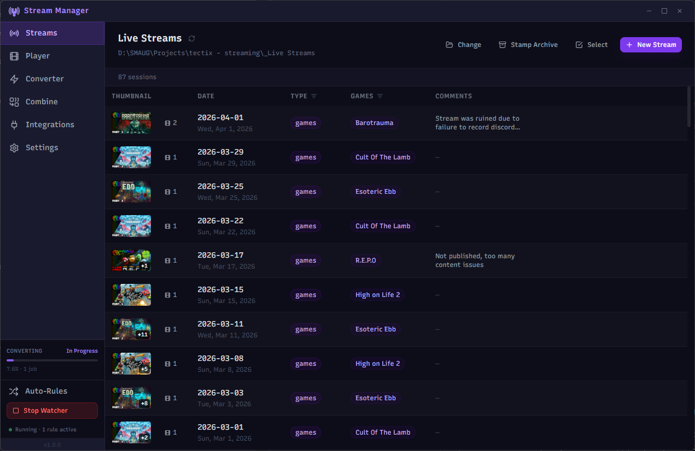

# Stream Manager


A desktop app for streamers to manage, review, and process their local recording files. Built with Electron + React.



> 100% vibe-coded with [Claude](https://claude.ai) (Anthropic) — every line of code in this project was written through conversation with Claude Code (I only made the crappy logo lol). Think of that what you will, but the result is a fully functional Electron app that meets my requirements for a personal stream management tool. I'm sharing it here in case it can be useful to other streamers with similar needs. It cost me about $30 and about 2 days of back-and-forth with Claude Code to build. I hope it can save other streamers time and money by providing a ready-made solution for managing their local stream recordings.

---

## Features

### Streams

The main hub for browsing and managing your local stream sessions. Each date folder is scanned automatically for video files and thumbnails, displayed as a row with:

- Auto-detection of stream files (video and thumbnails) from date-based folders
- Custom tagging and metadata — games played, stream type, and freeform comments
- Batch archive processing — multi-select sessions and compress them in bulk using a conversion preset
- Cloud-sync aware — offline files (e.g. Synology Drive) are detected and skipped to prevent unwanted downloads

**Metadata** is stored in a single `_meta.json` file at the root of your streams directory rather than inside individual session folders, so taking folders offline doesn't affect the app's ability to read session information. Missing folders are detected on load and the user is prompted to remove stale records or keep them visible as warnings.

### Video Player

Drop or browse to any video file and play it back with a visual thumbnail strip for timeline scrubbing. Multi-track audio (common in OBS recordings) is explicitly supported — select which tracks to merge. Merged audio is cached to disk so repeat opens are instant.

### Converter

Queue video files for conversion using ffmpeg presets. Supports pause, resume, and cancel per job with ETA tracking. Presets can be imported directly from HandBrake preset files or created manually as JSON.

### Combine

Concatenate multiple video files into one with zero re-encoding (ffmpeg concat demuxer). Files are auto-sorted by timestamp parsed from OBS-style filenames and can be manually reordered by drag-and-drop. Optionally deletes source files after a successful combine.

### Auto-Rules

File watcher rules that automatically move, copy, or rename files matching a glob pattern when they appear in a watched folder. Rules can be individually enabled/disabled. The watcher can be configured to start automatically on launch and is always accessible via the sidebar widget.

### YouTube & Twitch Integrations

- Update a live YouTube broadcast title, description, tags, and game title directly from the app
- Update Twitch channel title and category
- Title/description/tag template system for reusable formats with merge fields

---

## Getting Started

### Prerequisites

- [Node.js](https://nodejs.org/) 18+
- npm

### Install & run

```bash
npm install
npm run dev
```

### Build portable executable (Windows)

```bash
npm run dist
```

Outputs a single portable `.exe` to `dist/` — no installation required, runs from anywhere.

> **Before building:** export `src/renderer/src/assets/stream-manager-logo.svg` as a 256×256 PNG and save it to `resources/icon.png`.

---

## Tech Stack

| Layer         | Technology                                                                     |
| ------------- | ------------------------------------------------------------------------------ |
| Framework     | [Electron](https://www.electronjs.org/) 28                                     |
| UI            | [React](https://react.dev/) 18 + [TypeScript](https://www.typescriptlang.org/) |
| Styling       | [Tailwind CSS](https://tailwindcss.com/) 3                                     |
| Icons         | [Lucide React](https://lucide.dev/)                                            |
| Video         | [ffmpeg-static](https://github.com/eugeneware/ffmpeg-static)                   |
|               | [fluent-ffmpeg](https://github.com/fluent-ffmpeg/node-fluent-ffmpeg)           |
| Persistence   | [electron-store](https://github.com/sindresorhus/electron-store)               |
| File watching | [chokidar](https://github.com/paulmillr/chokidar)                              |
| Bundler       | [electron-vite](https://electron-vite.github.io/)                              |
| Packaging     | [electron-builder](https://www.electron.build/)                                |

---

## Project Structure

```text
src/
├── main/               # Electron main process
│   ├── ipc/            # IPC handlers (video, files, streams, combine, converter, store, …)
│   └── services/       # ffmpeg, cache managers (audio, thumbnail, waveform), file watcher
├── preload/            # Context bridge — exposes typed API to renderer
└── renderer/           # React app
    └── src/
        ├── components/
        │   ├── pages/  # StreamsPage, PlayerPage, ConverterPage, CombinePage, …
        │   └── ui/     # Button, Modal, Slider, Input, FileDropZone
        ├── context/    # ConversionContext, WatcherContext
        ├── hooks/      # useVideoPlayer, useStore, useThumbnailStrip, useWaveform
        └── types/      # Shared TypeScript interfaces
```

---

## Notes

- Session metadata is stored in `_meta.json` at the root of your streams directory (hidden file)
- Audio, thumbnail, and waveform caches are stored under the system temp directory in `stream-manager/`
- App configuration is persisted via `electron-store` in the OS app data folder
- The portable build bundles ffmpeg and ffprobe — no system installation required
- The app is Windows-focused (cloud file attribute checks, portable `.exe` build target) but the core logic is cross-platform

---

## License

[MIT](LICENSE)
