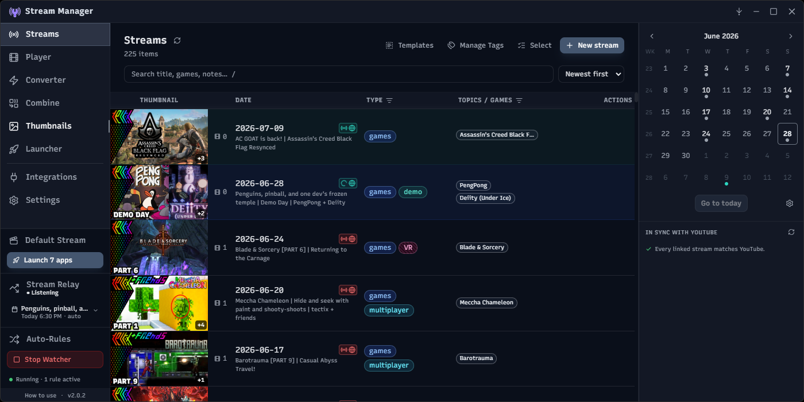
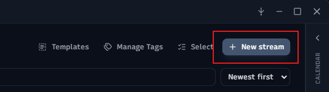
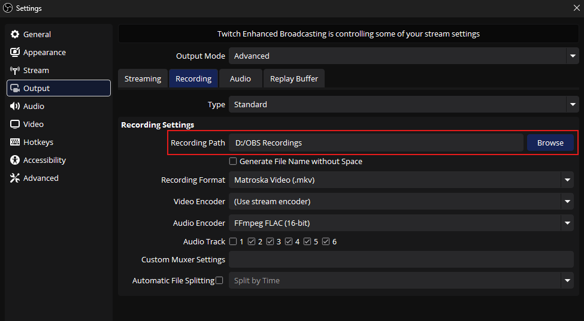
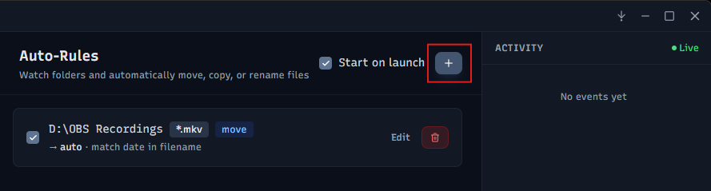
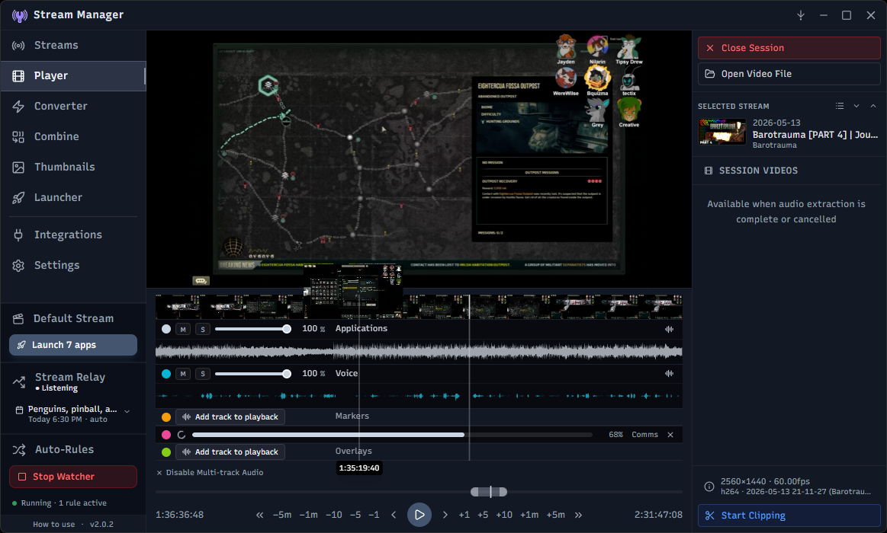
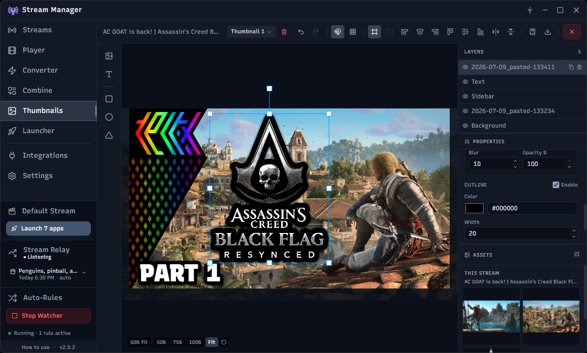
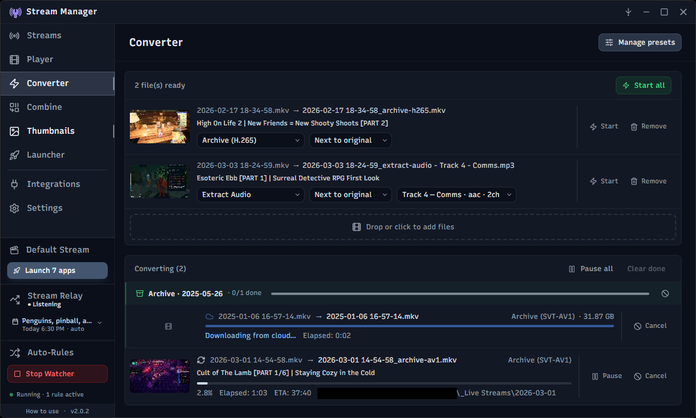
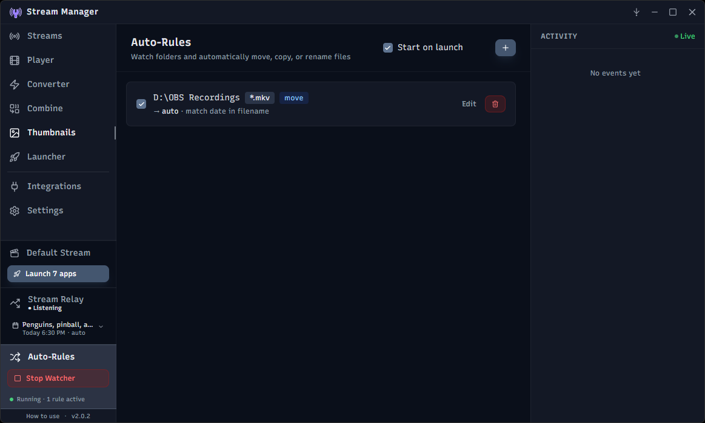
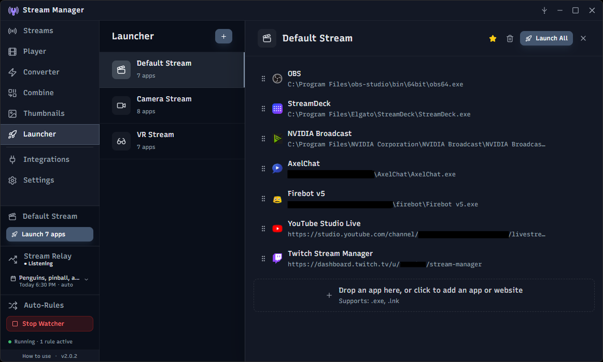
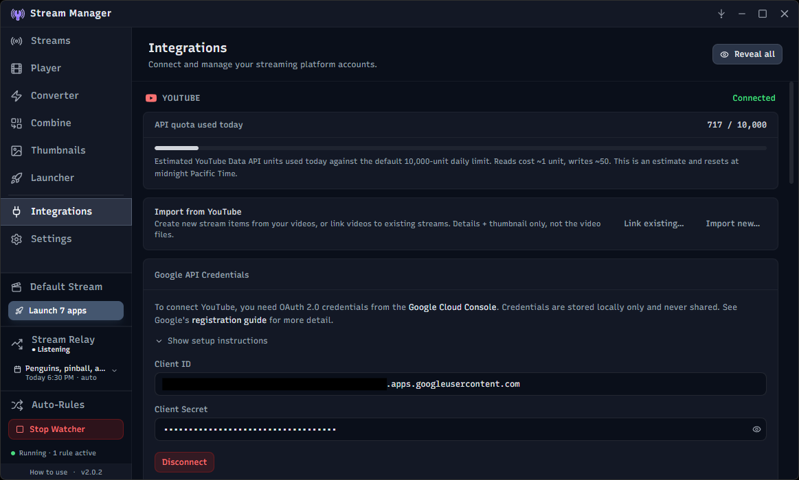

# Stream Manager

 A desktop app for streamers to manage, review, and process their local recording files. Yet another app built with Electron + React. Windows only (for now), feel free to adapt this to other platforms if you're so inclined. Contributions are welcome.



---

- [Stream Manager](#stream-manager)
  - [Getting Started (as a user)](#getting-started-as-a-user)
  - [Recommended Workflow](#recommended-workflow)
  - [Features](#features)
    - [Streams](#streams)
    - [Video Player](#video-player)
    - [Thumbnail Editor](#thumbnail-editor)
    - [Converter](#converter)
    - [Auto-Rules](#auto-rules)
    - [Launcher](#launcher)
    - [Integrations](#integrations)
      - [YouTube](#youtube)
      - [Twitch](#twitch)
      - [Claude AI](#claude-ai)
  - [Getting Started (as a dev)](#getting-started-as-a-dev)
    - [Prerequisites](#prerequisites)
    - [Install \& run](#install--run)
    - [Build portable executable (Windows)](#build-portable-executable-windows)
  - [Tech Stack](#tech-stack)
  - [Project Structure](#project-structure)
  - [License](#license)

---

## Getting Started (as a user)

1. Download the latest release for Windows from the [Releases](https://github.com/your-repo/Stream-Manager/releases) page.
2. Extract the ZIP file and run `StreamManager.exe` (no installation required, runs from anywhere, can be moved freely. Data is stored on your machine in a safe place).
3. On first launch, you'll be prompted to select your main "Streams" folder where your recordings are stored. The app **scans the folder and auto-detects your layout** — flat folder-per-stream, nested under year/month groupings, dump-folder, or empty (fresh start) — and pre-selects the right mode. You can override the detected mode if needed, and you can change the folder later from Settings.
   - You can choose between 2 modes: **Dump mode** (all files are stored in the root of the selected folder) or **Folder-per-stream mode** (each stream session gets its own subfolder, optionally with sub-folders for clips, recordings, exports, etc.).
   - I recommend **Folder-per-stream mode** for better organization and to avoid clutter, but the app supports both.
   - If you choose **Dump mode**, the app will still be able to detect and group your recordings based on their filenames, but all files will remain in a single folder.
   - You can choose to convert an existing **dump** folder structure to **folder-per-stream** format during setup, or later via the **Convert to folder-per-stream** button in Settings.
4. (optional) Connect the app to YouTube and/or Twitch to enable direct uploading and metadata synchronization for your streams.

---

## Recommended Workflow

1. Before you stream, click the "New Stream" button to initialize a new stream session folder with the date-based naming format. This will help the app automatically detect and group your recordings and assets later on. Here, you can also write and send title, description, tags, and game info to YouTube and Twitch if you have those integrations set up. Those will also be saved as metadata for the stream session and can be edited later.

   
2. Set your streaming software (OBS, Streamlabs, etc.) to save recordings to a designated "Raw Recordings" folder. This will keep your recording app's settings simple. This is also important if you use cloud-sync software like Synology Drive NAS, OneDrive, or Google Drive to backup your streams. Recording directly to a cloud-synced folder can cause encoding errors and ruin recordings. Stream Manager detects and intelligently adapts to cloud-synced storage.

   
3. Set up an auto-rule in the app to watch that recordings folder and move/rename new files to your main "Streams" folder in the date-based format that the app recognizes. I recommend keeping the app open while streaming so the watcher can automatically organize your recordings as soon as they are finished, but you can also open the app after your stream and it will detect any new files and automatically organize them for you (if you have the auto-start file watcher setting enabled).

    
4. _**Stream your heart out!**_
5. After your stream, the app will have automatically organized your recordings. Find the session in the Streams page and optionally add any missing info like the topics, games played, stream type, and personal comments to help you remember the details of each session.
6. Review the recording in the built-in player and export clips for sharing on social media or YouTube, or send the whole session to the converter to compress it for other uses like archiving or uploading to other services.

## Features

Stream Manager is built around keeping everything about your stream sessions in one place — the recording, metadata, clips, and publishing destinations all collected and organized.

### Streams


The main hub for browsing and managing local recordings of your stream sessions. Video files, thumbnails, and other related assets in your designated folder are scanned and grouped automatically:

- **Auto-detection of stream files** (video and thumbnails) from date-based naming conventions (the default OBS format).
- **Flexible folder layouts** — flat (all stream folders directly inside the streams root), nested (grouped under year/month/etc. up to 5 levels deep), or dump-folder (single shared directory). Each stream folder can also have its own sub-org (`clips/`, `recordings/`, `exports/`, etc.) that's recursively scanned.
- **Custom tagging and metadata** — games played, stream type, and freeform comments. Stream types support custom color and texture theming so you can visually distinguish categories at a glance. Add and style tags to work for you.
- **Episode series tracking** — group related streams into seasons and episodes so series playthroughs are numbered correctly. Season, episode, total-episode merge fields become available in stream titles and description templates.
- **Batch archive processing** — multi-select sessions and compress the video files inside in bulk using a conversion preset.
- **Cloud-sync aware** — offline files (Synology Drive, OneDrive, DropBox, Google Drive, etc.) are detected and certain features are adapted to prevent unwanted bulk downloads.
- **Reusable templates** for titles, descriptions, and tags with merge fields including `{game}`, `{season}`, `{episode}`, `{total_episodes}`, and `{title}`. Save new templates quickly from any stream's metadata editor.

**Metadata** is stored in a single `_meta.json` file at the root of your streams directory, so stream info is maintained and validated separately from the files themselves allowing easy movement of your library and the location of the app.

**LLM-assisted metadata** — if you have a Claude API key configured in Integrations, press **Ctrl+Space** in any YouTube title, description, or tags field while editing a stream to get an inline suggestion generated at the cursor position. The suggestion appears as ghost text; press **Tab** to accept or **Esc** to dismiss. The model uses the stream's date, games, and type tags as context.

### Video Player



Open your stream videos and clips (or drop in any video file) and play it back with thumbnail and waveform tracks. Multi-track audio (common in OBS recordings) is supported. Review, clip, and export stream sessions with precision using these tools:

- **Single-click screenshot capture** — capture a screenshot at the current playback position and save it as a PNG file. The file is named with the original video filename plus the timestamp and saved to the same folder as the video for easy reference or making thumbnails.
- **Multi-track audio support** — if multiple audio tracks are detected, the user can choose to merge them into a single track for easier playback and clipping (Chromium limits audio playback from a video file to only one track at a time). Merged audio is temporary, so it won't clutter your folders.
- **Thumbnail strip** — extracted from the video at intervals to provide visual cues while scrubbing.
- **Waveform display** — full-file audio waveform rendered as a zoomable strip. Raw PCM is sampled at 200 Hz and cached to disk; the visible range is re-bucketed to 1,200 peaks on the fly so detail stays sharp at any zoom level.
- **Clip mode with auto-saved drafts** — split a recording into any number of segments and export a polished clip directly from the player. Your work autosaves to the stream folder as you go, so closing the video, switching streams, or coming back tomorrow all pick up exactly where you left off. Exported clips stay linked to their source and are one click away from being branched into a brand-new draft, so the original export always stays intact.
- **Shape-aware cropping** — pick the export aspect (16:9, 1:1, 9:16, or the video's native ratio) and drag or scale the crop box independently for each segment. Repurpose the same highlight for widescreen, square, or vertical clips without re-editing — and clips exported with a 9:16 crop are automatically tagged as shorts. Fine-control inputs let you nudge the crop region's center offset (x/y) and dimensions (w/h) in source pixels, with a one-click reset.
- **Bleep markers** — mark regions to be bleeped or silenced (censored) while clipping. Mutes all audio for the duration of the bleep marker.
- **Session Videos panel** — every video, draft, and exported clip in the current stream folder shown in a live, hierarchical list. Exports and drafts nest under their source video.
- **Video pop-out for OBS** — pop the video into a dedicated frameless window sized to the video's native resolution. Streaming software like OBS can then capture that window independently. The pop-out locks its aspect ratio on resize and has no rounded corners. Use the precision playback controls to go frame-by-frame forward AND BACKWARD (I'm looking at you VLC!) or seek to a specific timecode and immediately see it in the pop-up.
- **Keyboard shortcuts** — editor-style shortcut suite covering playback (Space, J/K/L, arrow combos for frame and ±1/5/10s skip), session-video navigation (Ctrl+Alt+↑/↓), clip mode toggles, segment/split/bleep insertion, marker-to-marker jumps with `[` / `]`, timeline zoom anchored on the playhead, screenshot, file open, and clip export.

### Thumbnail Editor



A built-in canvas editor for designing stream and clip thumbnails without leaving the app. Save reusable templates, then pick one when you create a new stream to instantly get a finished thumbnail with your standard branding.

- **Layered canvas** — drop in images, text, and shapes. Layers support drag, resize, rotate, opacity, ordering, and visibility toggles.
- **Smart + grid snapping** — objects snap to canvas edges, each other's edges/centers, and an optional grid. Hold **Shift** while dragging to constrain to the dominant axis.
- **Templates** — save a layout (minus the stream-specific content) as a reusable template. Pick a built-in template right from the new-stream dialog (or set a default in Settings) and it auto-loads on the first edit, so the work area opens pre-populated with your branding.
- **Per-stream autosave** — thumbnails save to the stream folder as you edit and re-open to exactly where you left off; exported PNGs live alongside the source video so they're detected as stream thumbnails automatically.
- **Undo/redo, recents, and keyboard shortcuts** for fast iteration.

### Converter



Queue video files for conversion using ffmpeg presets.

- **Conversion presets** — Presets I've personally found useful are included out of the box. New presets can be imported from other apps such as HandBrake (JSON format) or created manually if you're adventurous.
- **Auto-archiving** — optionally send stream sessions to the converter with a selected "Archive" preset directly from the Streams page. This is a great way to quickly compress and organize stream recordings without having to manually add them to the converter.
- **Remuxing support** — Like the OBS "Remux Recordings" feature, the app can quickly change a video's container format (e.g. from MKV to MP4) without re-encoding, as long as the video and audio codecs are compatible. This is great for making your recordings more widely compatible without losing quality or spending time on a full conversion or having to open OBS.
- **Combine tool** — concatenate multiple video files into one with zero re-encoding using ffmpeg's concat demuxer. Files are auto-sorted by timestamp parsed from OBS-style filenames and can be manually reordered by drag-and-drop. Optionally deletes source files after a successful combine. This is useful for streamers who have their recordings split into multiple files due to file size limits or accidental stops/starts, and want to easily merge them back together without losing quality or having to open a full video editor.
- **Persistent queue** — auto-rule jobs queued without "Start immediately" survive app restarts and reappear in the converter on next launch.
- **Sidebar widget** — Easily visualize progress with the sidebar widget while doing other tasks in-app.

### Auto-Rules



File watcher rules that can automatically **move, copy, rename, or convert** files matching a glob pattern when they appear in a watched folder. Rules can be individually enabled/disabled and given an optional name to distinguish similar setups in the rule list and activity log. The watcher can be configured to start automatically on launch and is always accessible via the sidebar widget. This is useful for streamers who want to automate the organization of their recordings as soon as they are created by their streaming software, without having to manually move files around or run batch processes.

For instance, if you record directly to a "Raw Recordings" folder, you can set up a rule to automatically move them to your main "Streams" folder and rename them to match the OBS date-based format that the app recognizes. The app will then automatically pick them up and add them to your stream library with in the correct location.

The **convert** action takes this one step further: matched files can be queued into the converter with your chosen preset and routed to a destination (static, auto-detected stream folder, or next to the original). Combine it with the watcher and you get end-to-end pipelines like "drop a raw MKV here → end up with a compressed MP4 in the right stream folder, ready to upload." Start immediately or leave conversions queued for a manual start.

### Launcher



Create named groups of apps that can be launched together with a single click — useful for spinning up your full streaming setup (OBS, chat apps, Discord, game launchers, browser profiles, and any other apps that help you stream) all at once.

- **Launch groups** — organize apps into named groups, each with a custom icon (chosen from the full Lucide icon library) and a reorderable app list. Apps can be `.exe` files or `.lnk` shortcuts, and can be browsed or dragged directly from Explorer.
- **Individual launch** — launch a single app from a group without firing the rest.
- **Sidebar widget** — pin one group to the sidebar for one-click access without navigating to the Launcher page.

### Integrations



#### YouTube

- OAuth connection — authorize once and the app manages token refresh automatically. Connection status is shown in the sidebar.
- Update title, thumbnail, description, and tags, directly from Stream Manager (but not category or game titles, boo YouTube...). This works for upcoming livestreams, past VODs, and regular videos. For instance, if you had to re-upload a video, you can connect it to the stream item in the app to update its details with the stored stream info in the app, directly from the app.

_You will need a google cloud project and OAuth 2.0 credentials to connect your YouTube account._

#### Twitch

- OAuth connection with automatic token refresh.
- Update your Twitch channel title and category from the same stream item metadata dialogs as YouTube.
- Optionally sync the Twitch title with your YouTube title, or manage them independently.

#### Claude AI

- Connect your [Anthropic API key](https://console.anthropic.com/) to enable AI-assisted YouTube details generation, powered by [Claude Haiku](https://www.anthropic.com/claude/haiku).
- Press **Ctrl+Space** in the title, description, or tags field while editing stream metadata to request a suggestion at the cursor position. Suggestions appear as inline ghost text — **Tab** to accept, **Esc** to dismiss.
- An optional system prompt lets you give the model standing instructions about your channel's style and tone.
- The API key is stored locally and never sent to any servers other than Anthropic's.

---

## Getting Started (as a dev)

### Prerequisites

- [Node.js](https://nodejs.org/) 18+
- npm

### Install & run

```bash
npm install
npm run dev
```

### Build portable executable (Windows)

```bash
npm run dist
```

Outputs a single portable `.exe` to `dist/` — no installation required, runs from anywhere.

> **Before building:** export `src/renderer/src/assets/stream-manager-logo.svg` as a 256×256 PNG and save it to `resources/icon.png`.

---

## Tech Stack

| Layer            | Technology                                                                     |
| ---------------- | ------------------------------------------------------------------------------ |
| Framework        | [Electron](https://www.electronjs.org/) 34                                     |
| UI               | [React](https://react.dev/) 18 + [TypeScript](https://www.typescriptlang.org/) |
| Styling          | [Tailwind CSS](https://tailwindcss.com/) 3                                     |
| Icons            | [Lucide React](https://lucide.dev/)                                            |
| Animation        | [motion](https://motion.dev/)                                                  |
| Thumbnail canvas | [Konva](https://konvajs.org/) + [react-konva](https://konvajs.org/docs/react/) |
| Video            | [ffmpeg-static](https://github.com/eugeneware/ffmpeg-static)                   |
|                  | [fluent-ffmpeg](https://github.com/fluent-ffmpeg/node-fluent-ffmpeg)           |
| Persistence      | [electron-store](https://github.com/sindresorhus/electron-store)               |
| File watching    | [chokidar](https://github.com/paulmillr/chokidar)                              |
| Bundler          | [electron-vite](https://electron-vite.github.io/)                              |
| Packaging        | [electron-builder](https://www.electron.build/)                                |

---

## Project Structure

```text
src/
├── main/                       # Electron main process
│   ├── ipc/
│   │   ├── claude.ts           # Claude AI metadata generation
│   │   ├── combine.ts          # Concat-demux pipeline
│   │   ├── converter.ts        # ffmpeg conversion queue + clip export tagging
│   │   ├── files.ts            # File system operations
│   │   ├── launcher.ts         # App launch groups
│   │   ├── store.ts            # App config persistence
│   │   ├── streams.ts          # Stream folder management + clip drafts
│   │   ├── templates.ts        # Folder template engine
│   │   ├── thumbnail.ts        # Thumbnail editor templates & canvas persistence
│   │   ├── twitch.ts           # Twitch API integration
│   │   ├── video.ts            # Playback, waveform, thumbnails
│   │   ├── videoPopup.ts       # OBS pop-out window (frameless, aspect-locked)
│   │   └── youtube.ts          # YouTube API integration
│   └── services/
│       ├── audioCacheManager.ts      # Extracted track cache
│       ├── ffmpegService.ts          # ffmpeg/ffprobe wrappers
│       ├── fileWatcher.ts            # chokidar-based auto-rules watcher
│       ├── tempManager.ts            # Temp file lifecycle
│       ├── thumbnailCacheManager.ts  # Per-file thumbnail cache
│       ├── twitchApi.ts / twitchAuth.ts
│       ├── waveformCacheManager.ts   # Binary PCM waveform cache
│       └── youtubeApi.ts / youtubeAuth.ts
├── preload/
│   ├── index.ts        # Context bridge — exposes typed api to renderer
│   └── popup.ts        # Context bridge for the video pop-out window
└── renderer/
    ├── index.html
    ├── popup.html              # Minimal shell for the video pop-out
    └── src/
        ├── popup.ts            # Pop-out player logic (vanilla TS, no React)
        ├── components/
        │   ├── OnboardingModal.tsx
        │   ├── pages/
        │   │   ├── PlayerPage.tsx        # Video player, waveform, clip mode with drafts, shape-aware crop, bleep markers, Session Videos panel
        │   │   ├── StreamsPage.tsx       # Stream session browser
        │   │   ├── ConverterPage.tsx
        │   │   ├── CombinePage.tsx
        │   │   ├── RulesPage.tsx         # Auto-rules / file watcher (move/copy/rename/convert)
        │   │   ├── SettingsPage.tsx
        │   │   ├── TemplatesPage.tsx
        │   │   ├── ThumbnailPage.tsx     # Konva-based thumbnail editor w/ templates, snapping, undo/redo
        │   │   ├── LauncherPage.tsx      # App launch groups
        │   │   └── IntegrationsPage.tsx  # YouTube, Twitch, Claude AI
        │   └── ui/             # Button, Modal, Slider, Tooltip, GhostTextArea, …
        ├── context/            # ConversionContext, WatcherContext, StoreContext, ThumbnailEditorContext
        ├── hooks/
        │   ├── useVideoPlayer.ts       # Playback, seek throttling, multi-track sync
        │   ├── useWaveform.ts          # PCM re-bucketing, SVG path generation
        │   ├── useThumbnailStrip.ts
        │   ├── useFieldSuggestion.ts   # Ctrl+Space AI suggestion for inputs
        │   └── useStore.ts
        └── types/              # Shared TypeScript interfaces
```

---

## License

[MIT](LICENSE)
