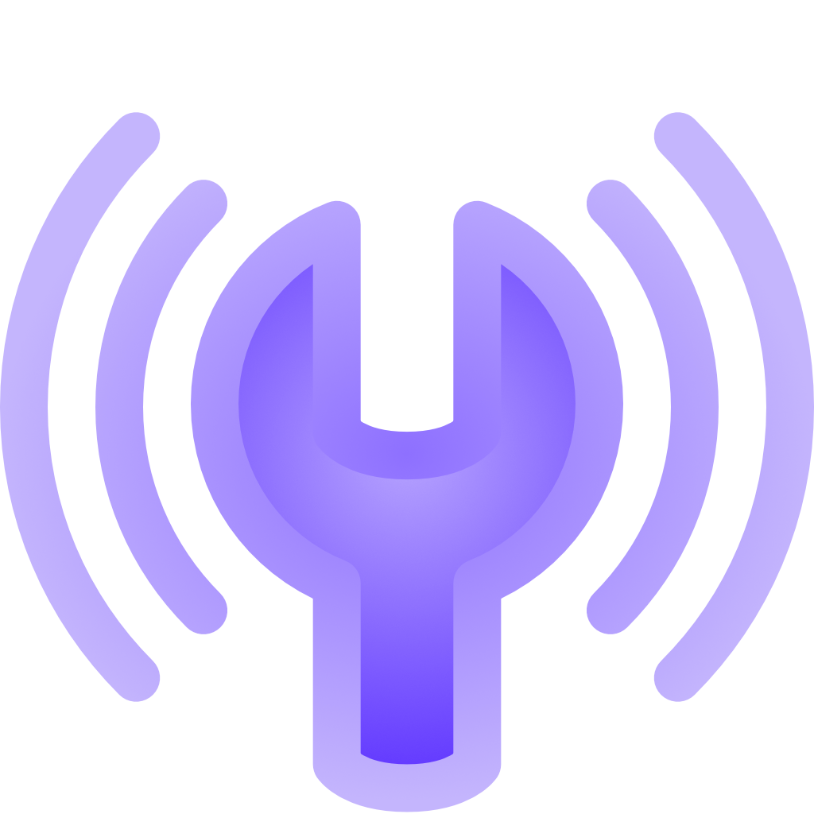
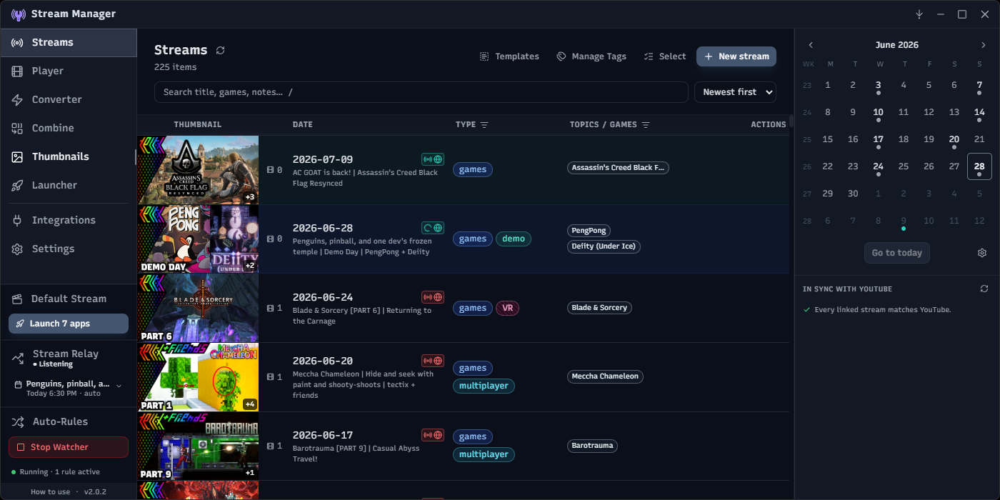
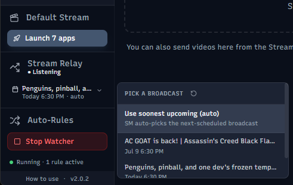
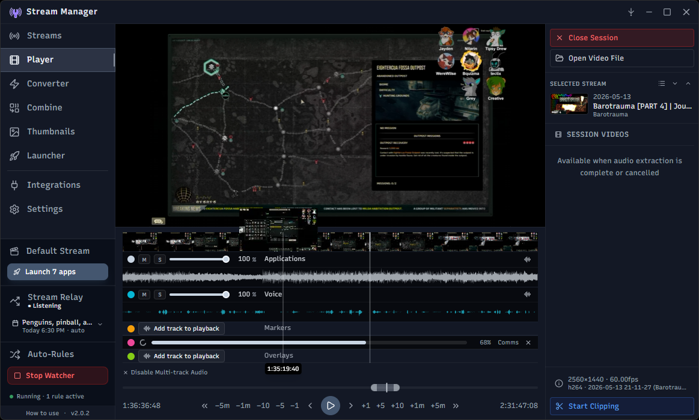
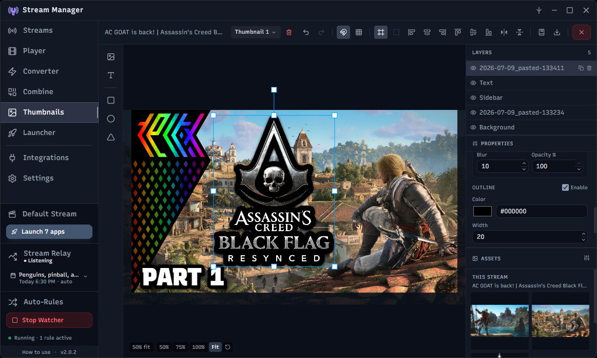
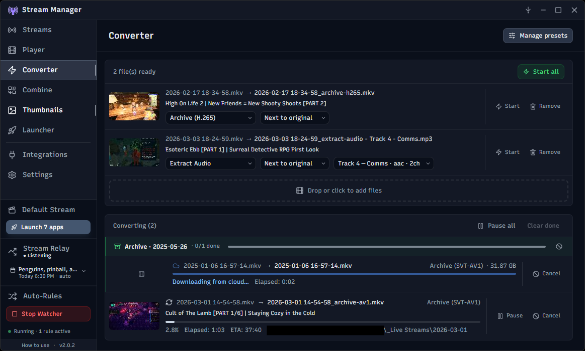
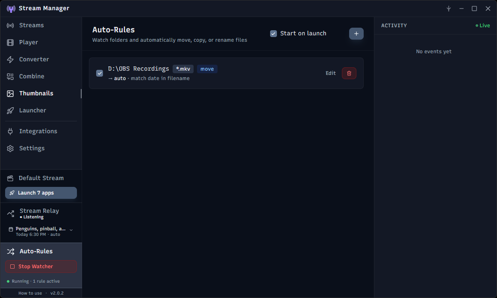
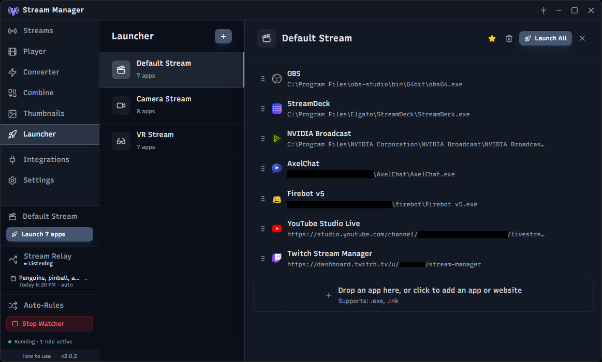
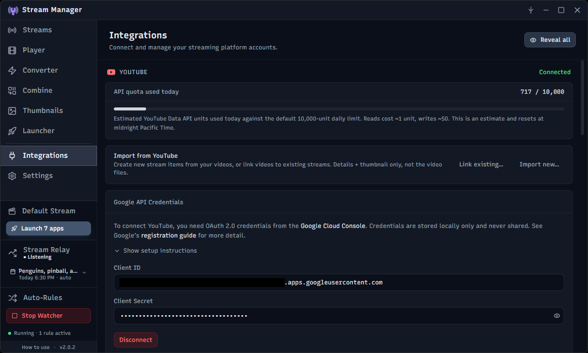

#  Stream Manager

**Website:** [stream-manager.app](https://stream-manager.app/) · **Discord:** [Join the community](https://discord.gg/ufMSh9d8hu)

[](https://opensource.org/licenses/MIT)
[](https://github.com/pjmdesi/stream-manager/releases/latest)
[](https://github.com/pjmdesi/stream-manager/releases)
[](https://github.com/pjmdesi/stream-manager#)

A desktop app that's the central hub for your stream sessions: organize your local recordings, edit and publish your YouTube/Twitch metadata, clip and create thumbnails, and even route your broadcast live. Windows only for now; contributions welcome.

**Explore:** [Feature tour](https://stream-manager.app/features) · [Getting-started guide](https://stream-manager.app/get-started) · [FAQ](https://stream-manager.app/faq) · [About the project](https://stream-manager.app/about)

## Mission

Stream Manager is designed to be the central hub for everything pre- and post-stream. It organizes your raw files, metadata, clips, and workflow in one place so you can spend less time wrangling files and more time creating content. If used in the recommended way, you should never have to open your file explorer again to manage your stream-related files.

## Who this is for

- Streamers who record and store their streams locally and want a better way to manage those files and related metadata.
- Streamers who stream to YouTube and/or Twitch and want an easier way to keep their stream metadata in sync with their local files.
- Streamers who go live to YouTube and want the app to bind and transition their broadcast automatically when they start and stop their encoder.
- Streamers who want a built-in tool for clipping and thumbnail creation without needing to use separate apps like Premiere, DaVinci, HandBrake, Photoshop, Affinity, etc.
- Streamers who want to automate parts of their workflow, like moving files from a recording folder to their main stream library, launching all their streaming apps at once, and archiving old streams with consistent encoding settings and tagging.



---

- [Stream Manager](#stream-manager)
  - [Mission](#mission)
  - [Who this is for](#who-this-is-for)
  - [Quick Start](#quick-start)
  - [How this is built](#how-this-is-built)
  - [Features](#features)
    - [Streams](#streams)
    - [Stream Relay](#stream-relay)
    - [Video Player](#video-player)
    - [Thumbnail Editor](#thumbnail-editor)
    - [Converter](#converter)
    - [Auto-Rules](#auto-rules)
    - [Launcher](#launcher)
    - [Integrations](#integrations)
  - [Getting Started (as a dev)](#getting-started-as-a-dev)
    - [Prerequisites](#prerequisites)
    - [Install \& run](#install--run)
    - [Build portable executable (Windows)](#build-portable-executable-windows)
  - [Tech Stack](#tech-stack)
  - [Project Structure](#project-structure)
  - [License](#license)

---

## Quick Start

> The full setup walkthrough with screenshots: recording folder, auto-rules, OBS settings, and the recommended stream-day workflow. Lives in the [getting-started guide on stream-manager.app](https://stream-manager.app/get-started).

**Before starting:** Stream Manager requires consistent naming of files that must include the stream date (preferably as the first part of the filename). The default OBS naming format (`YYYY-MM-DD HH-MM-SS`) is recommended and works out of the box.

1. Download the latest release for Windows from the [Releases](https://github.com/pjmdesi/stream-manager/releases) page.
2. Run the portable `.exe`. No installation required, runs from anywhere. Settings live in AppData; stream item data is stored next to your stream files.
3. Select your main "Streams" folder when prompted. The app scans it, auto-detects your folder structure, and groups your recordings, thumbnails, and related files into stream items.
4. (Optional) Set up an auto-rule to watch your recording software's output folder, and connect YouTube/Twitch for metadata sync and the Stream Relay.

Questions about setup, platform limits, or how the app handles your files? Check the [FAQ](https://stream-manager.app/faq).

---

## How this is built

Stream Manager is built with substantial assistance from Claude (Anthropic's AI assistant) and GitHub Copilot. I'm a front-end developer by trade with a cursory understanding of backend systems; building a full Electron desktop app with multi-track video processing, ffmpeg integration, OAuth flows, and cloud-aware file handling is outside my normal scope and would take years to learn. If you want to see an example of a fully hand-coded application of mine, see [ClpChk](https://github.com/pjmdesi/clp-chk-react).  
Claude is used heavily for architecture, implementation, debugging, code cleanup, and documentation through months of iterative back-and-forth. The product direction, UX decisions, feature scope, testing, and final calls on what is shipped are mine. More about the project and the person behind it is on the [about page](https://stream-manager.app/about). If you're curious about my take on AI-assisted development, I'm happy to discuss in issues or Discord.

---

## Features

Stream Manager keeps everything about your stream sessions in one place: the recording, metadata, clips, and publishing destinations all collected and organized. The summaries below cover the essentials. The [full feature tour](https://stream-manager.app/features) goes deeper on each one.

### Streams


The main hub for your local stream recordings. Video files, thumbnails, and related assets are scanned and grouped into stream sessions automatically, with two-way YouTube & Twitch metadata sync (per-field out-of-sync indicators show exactly what differs), import & bulk-link from your existing YouTube channel, custom game/topic tagging, and episode series tracking with merge-field templates (`{game}`, `{season}`, `{episode}`, …). Cloud-sync aware: files offloaded by Synology Drive, OneDrive, Dropbox, or Google Drive are detected, and you can offload or pin local in bulk. Metadata lives in a single `_meta.json` beside your files, so your library moves freely. With a Claude API key connected, **Ctrl+Space** gives inline AI suggestions in any YouTube title, description, or tags field.

### Stream Relay



The app sits between your encoder (OBS, etc.) and YouTube as a local relay and manages the broadcast lifecycle for you: it binds your chosen (or soonest-scheduled) broadcast, takes it live the moment your encoder connects, and ends it when you stop (with a grace period so a momentary encoder drop doesn't kill your stream). It can also roll your Twitch title and category forward to the next scheduled broadcast after each session. The relay forwards your already-encoded stream without re-encoding, so there's no meaningful extra CPU/GPU load.

### Video Player



Review, clip, and export stream sessions with thumbnail and waveform tracks. Multi-track recordings get per-track mute/solo/volume with your choice of tracks in the export mix; clip drafts stay linked to their source so the original is always intact; shape-aware cropping repurposes one highlight as widescreen, square, or vertical; bleep markers censor regions with a mute or tone; and a frameless pop-out window lets OBS capture playback cleanly for rolling clips on stream.

### Thumbnail Editor



A built-in canvas editor for designing stream and clip thumbnails without leaving the app. Save layouts as reusable templates, and use merge fields (`{title}`, `{game}`, `{date}`, `{season}`, `{episode}`) in text layers that substitute live. One template covers a whole series with your standard branding.

### Converter



Queue video conversions using ffmpeg presets (useful presets included; HandBrake JSON presets import directly). Batch-archive sessions straight from the Streams page, remux containers (e.g. MKV → MP4) without re-encoding, and combine multiple recordings into one file losslessly with the concat demuxer.

### Auto-Rules



File-watcher rules that automatically **move, copy, rename, or convert** new files. Date-matched rules route recordings into the stream session matching the date in the filename, including sessions that run past midnight. These land with the previous day's stream instead of a phantom new one.

### Launcher



Launch your full streaming setup (OBS, chat apps, Discord, game launchers, browser profiles) with a single click via named launch groups. Each launch item has a custom icon, individual-launch buttons, and an optional pinned sidebar widget.

### Integrations



- **YouTube:** powers the metadata sync, import/bulk-link, and Stream Relay. Authorize once and the app handles token refresh. _Requires your own Google Cloud project and OAuth 2.0 credentials._
- **Twitch:** OAuth connection with automatic token refresh; update your channel title, category, and tags from the stream item metadata.
- **Claude AI:** connect your [Anthropic API key](https://console.anthropic.com/) for inline AI-assisted YouTube details (**Ctrl+Space**, Tab to accept), with your choice of model and an optional standing system prompt. The key is stored locally and only ever sent to Anthropic.

What each platform's API can and can't sync (VOD edits, categories, A/B thumbnail tests, go-live notifications) is covered in the [FAQ](https://stream-manager.app/faq).

---

## Getting Started (as a dev)

### Prerequisites

- [Node.js](https://nodejs.org/) 18+
- npm

### Install & run

```bash
npm install
npm run dev
```

### Build portable executable (Windows)

```bash
npm run dist
```

Outputs a single portable `.exe` to `dist/`: no installation required, runs from anywhere.

> **Before building:** export `src/renderer/src/assets/stream-manager-logo.svg` as a 256×256 PNG and save it to `resources/icon.png`.

### Open Dev tools in production build
While the app is running, press **Ctrl+`** to open the Chromium dev tools.

---

## Tech Stack

| Layer            | Technology                                                                     |
| ---------------- | ------------------------------------------------------------------------------ |
| Framework        | [Electron](https://www.electronjs.org/) 34                                     |
| UI               | [React](https://react.dev/) 18 + [TypeScript](https://www.typescriptlang.org/) |
| Styling          | [Tailwind CSS](https://tailwindcss.com/) 3                                     |
| Icons            | [Lucide React](https://lucide.dev/)                                            |
| Animation        | [motion](https://motion.dev/)                                                  |
| Thumbnail canvas | [Konva](https://konvajs.org/) + [react-konva](https://konvajs.org/docs/react/) |
| Video            | [ffmpeg-static](https://github.com/eugeneware/ffmpeg-static)                   |
|                  | [fluent-ffmpeg](https://github.com/fluent-ffmpeg/node-fluent-ffmpeg)           |
| Persistence      | [electron-store](https://github.com/sindresorhus/electron-store)               |
| File watching    | [chokidar](https://github.com/paulmillr/chokidar)                              |
| Bundler          | [electron-vite](https://electron-vite.github.io/)                              |
| Packaging        | [electron-builder](https://www.electron.build/)                                |

---

## Project Structure

```text
src/
├── main/                       # Electron main process
│   ├── ipc/
│   │   ├── claude.ts           # Claude AI metadata generation
│   │   ├── combine.ts          # Concat-demux pipeline
│   │   ├── converter.ts        # ffmpeg conversion queue + clip export tagging
│   │   ├── files.ts            # File system operations
│   │   ├── launcher.ts         # App launch groups
│   │   ├── store.ts            # App config persistence
│   │   ├── streams.ts          # Stream folder management + clip drafts
│   │   ├── templates.ts        # Folder template engine
│   │   ├── thumbnail.ts        # Thumbnail editor templates & canvas persistence
│   │   ├── twitch.ts           # Twitch API integration
│   │   ├── video.ts            # Playback, waveform, thumbnails
│   │   ├── videoPopup.ts       # OBS pop-out window (frameless, aspect-locked)
│   │   └── youtube.ts          # YouTube API integration
│   └── services/
│       ├── audioCacheManager.ts      # Extracted track cache
│       ├── ffmpegService.ts          # ffmpeg/ffprobe wrappers
│       ├── fileWatcher.ts            # chokidar-based auto-rules watcher
│       ├── tempManager.ts            # Temp file lifecycle
│       ├── thumbnailCacheManager.ts  # Per-file thumbnail cache
│       ├── twitchApi.ts / twitchAuth.ts
│       ├── waveformCacheManager.ts   # Binary PCM waveform cache
│       └── youtubeApi.ts / youtubeAuth.ts
├── preload/
│   ├── index.ts        # Context bridge: exposes typed api to renderer
│   └── popup.ts        # Context bridge for the video pop-out window
└── renderer/
    ├── index.html
    ├── popup.html              # Minimal shell for the video pop-out
    └── src/
        ├── popup.ts            # Pop-out player logic (vanilla TS, no React)
        ├── components/
        │   ├── OnboardingModal.tsx
        │   ├── pages/
        │   │   ├── PlayerPage.tsx        # Video player, waveform, clip mode with drafts, shape-aware crop, bleep markers, Session Videos panel
        │   │   ├── StreamsPage.tsx       # Stream session browser
        │   │   ├── ConverterPage.tsx
        │   │   ├── CombinePage.tsx
        │   │   ├── RulesPage.tsx         # Auto-rules / file watcher (move/copy/rename/convert)
        │   │   ├── SettingsPage.tsx
        │   │   ├── TemplatesPage.tsx
        │   │   ├── ThumbnailPage.tsx     # Konva-based thumbnail editor w/ templates, snapping, undo/redo
        │   │   ├── LauncherPage.tsx      # App launch groups
        │   │   └── IntegrationsPage.tsx  # YouTube, Twitch, Claude AI
        │   └── ui/             # Button, Modal, Slider, Tooltip, GhostTextArea, …
        ├── context/            # ConversionContext, WatcherContext, StoreContext, ThumbnailEditorContext
        ├── hooks/
        │   ├── useVideoPlayer.ts       # Playback, seek throttling, multi-track sync
        │   ├── useWaveform.ts          # PCM re-bucketing, SVG path generation
        │   ├── useThumbnailStrip.ts
        │   ├── useFieldSuggestion.ts   # Ctrl+Space AI suggestion for inputs
        │   └── useStore.ts
        └── types/              # Shared TypeScript interfaces
```

---

## License

[MIT](LICENSE)
