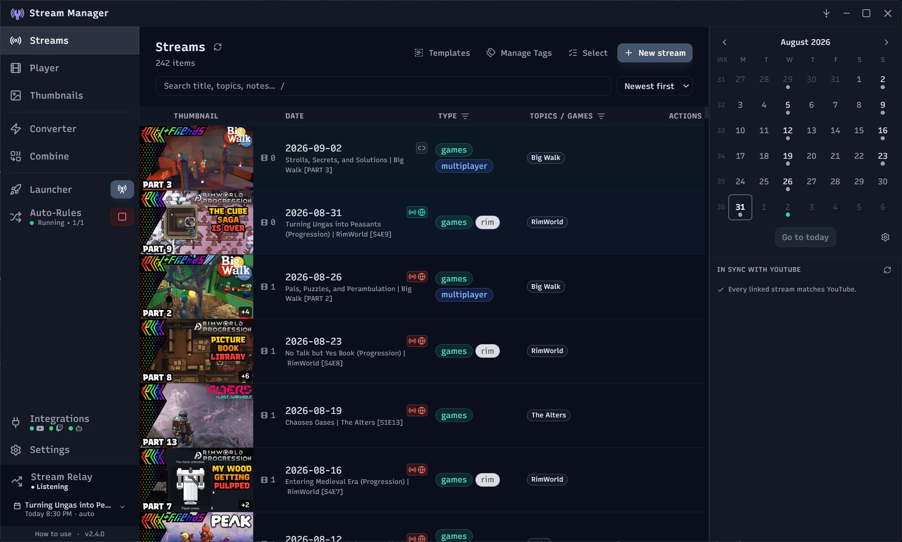

#  Stream Manager

**Website:** [stream-manager.app](https://stream-manager.app/) · **Discord:** [Join the community](https://discord.gg/ufMSh9d8hu)

[](https://opensource.org/licenses/MIT)
[](https://github.com/pjmdesi/stream-manager/releases/latest)
[](https://github.com/pjmdesi/stream-manager/releases)
[](https://github.com/pjmdesi/stream-manager#)

A desktop app that's the central hub for your stream sessions: organize your local recordings, edit and publish your YouTube/Twitch metadata, clip and create thumbnails, and even route your broadcast live. Windows only for now; contributions welcome.

**Explore:** [Feature tour](https://stream-manager.app/features) · [Getting-started guide](https://stream-manager.app/get-started) · [FAQ](https://stream-manager.app/faq) · [Design principles](https://stream-manager.app/principles) · [Privacy](https://stream-manager.app/app-privacy) · [About the project](https://stream-manager.app/about)

## Mission

Stream Manager is designed to be the central hub for everything pre- and post-stream. It organizes your raw files, metadata, clips, and workflow in one place so you can spend less time wrangling files and more time creating content. If used in the recommended way, you should never have to open your file explorer again to manage your stream-related files.

## Who this is for

- Streamers who record and store their streams locally and want a better way to manage those files and related metadata.
- Streamers who stream to YouTube and/or Twitch and want an easier way to keep their stream metadata in sync with their local files.
- Streamers who go live to YouTube and want the app to bind and transition their broadcast automatically when they start and stop their encoder.
- Streamers who want a built-in tool for clipping and thumbnail creation without needing to use separate apps like Premiere, DaVinci, HandBrake, Photoshop, Affinity, etc.
- Streamers who want to automate parts of their workflow, like moving files from a recording folder to their main stream library, launching all their streaming apps at once, and archiving old streams with consistent encoding settings and tagging.



---

## Quick Start

> The full setup walkthrough with screenshots: recording folder, auto-rules, OBS settings, and the recommended stream-day workflow. Lives in the [getting-started guide on stream-manager.app](https://stream-manager.app/get-started).

**Before starting:** Stream Manager requires consistent naming of files that must include the stream date (preferably as the first part of the filename). The default OBS naming format (`YYYY-MM-DD HH-MM-SS`) is recommended and works out of the box.

1. Download the latest release for Windows from the [Releases](https://github.com/pjmdesi/stream-manager/releases) page.
2. Run the portable `.exe`. No installation required, runs from anywhere. Settings live in AppData; stream item data is stored next to your stream files.
3. Select your main "Streams" folder when prompted. The app scans it, auto-detects your folder structure, and groups your recordings, thumbnails, and related files into stream items.
4. (Optional) Set up an auto-rule to watch your recording software's output folder, and connect YouTube and Twitch for metadata sync and the Stream Relay. YouTube connection is a guided, in-app walkthrough (also published at [stream-manager.app/youtube-setup](https://stream-manager.app/youtube-setup)).

Questions about setup, platform limits, or how the app handles your files? Check the [FAQ](https://stream-manager.app/faq) and the [privacy page](https://stream-manager.app/app-privacy).

---

## How this is built

Stream Manager is built with substantial assistance from Claude (Anthropic's AI assistant) and GitHub Copilot. I'm a front-end developer by trade with a cursory understanding of backend systems; building a full Electron desktop app with multi-track video processing, ffmpeg integration, OAuth flows, and cloud-aware file handling is outside my normal scope and would take years to learn. If you want to see an example of a fully hand-coded application of mine, see [ClpChk](https://github.com/pjmdesi/clp-chk-react).
Claude is used heavily for architecture, implementation, debugging, code cleanup, and documentation through months of iterative back-and-forth. The product direction, UX decisions, feature scope, testing, and final calls on what is shipped are mine. I thoroughly review and test all changes made to the code.

More about the project and the person behind it is on the website's [about page](https://stream-manager.app/about). If you're curious about my take on AI-assisted development, I'm happy to discuss in issues or Discord.

---

## Features

Stream Manager keeps everything about your stream sessions in one place: the recording, metadata, clips, and publishing destinations all collected and organized. Here are some brief highlights. The [feature tour](https://stream-manager.app/features) on the website has the screenshots and more detail.

**Streams.** The main hub for your local recordings. Video files, thumbnails, and related assets are scanned and grouped into stream items automatically, with two-way YouTube and Twitch metadata sync (per-field out-of-sync indicators show exactly what differs), import and bulk-link from your existing YouTube channel, game/topic tagging, and episode series tracking with merge-field templates (`{topic}`, `{season}`, `{episode}`, and more). Cloud-aware: files offloaded by Synology Drive, OneDrive, Dropbox, or iCloud are detected, and you can offload or pin local in bulk. Metadata lives in a single `_meta.json` beside your files, so your library can move freely.

**Stream Relay.** The app sits between your encoder (OBS, etc.) and YouTube as a local relay and manages the broadcast lifecycle: it binds your chosen (or soonest-scheduled) broadcast, takes it live when your encoder connects, and ends it when you stop, with a grace period so a momentary encoder drop doesn't kill your stream. It can also roll your Twitch title and category forward to the next scheduled broadcast after each session. The relay forwards your already-encoded stream without re-encoding.

**Video Player.** Review, clip, and export stream sessions with thumbnail and waveform tracks. Timeline markers (including chapters written by OBS's Hybrid MP4 chapter hotkey), per-track mute/solo/volume on multi-track recordings with your choice of tracks in the export mix, clip drafts that stay linked to their source, shape-aware cropping for widescreen, square, or vertical exports, bleep markers, and a frameless pop-out window that OBS can capture for rolling clips on stream.

**Thumbnail Editor.** A built-in canvas editor for stream and clip thumbnails. Save layouts as reusable templates, and use merge fields (`{title}`, `{topic}`, `{season}`, `{episode}`, `{date}`) in text layers that substitute live, so one template covers a whole series.

**Converter and Combine.** Queue video conversions using ffmpeg presets (useful presets included; HandBrake JSON presets import directly), batch-archive sessions straight from the Streams page, remux containers without re-encoding, and combine multiple recordings into one file losslessly.

**Auto-Rules.** File-watcher rules that move, copy, rename, or convert new files. Date-matched rules route recordings into the stream item matching the date in the filename, including sessions that run past midnight.

**Launcher.** Launch your full streaming setup (OBS, chat apps, Discord, game launchers, browser profiles) with a single click via named launch groups, each with its own icon and an optional pinned sidebar widget.

**Integrations.** YouTube (metadata sync, import, Stream Relay) through your own Google Cloud credentials, set up by an in-app guided walkthrough; Twitch (title, category, tags); and Claude, with your own Anthropic API key, for inline suggestions in YouTube title, description, and tag fields (**Ctrl+Space**, Tab to accept). All credentials are stored encrypted on your PC and sent only to the service they belong to. What each platform's API can and can't sync is covered in the [FAQ](https://stream-manager.app/faq); what the app does and doesn't do with your data is in the [design principles](https://stream-manager.app/principles) (canonical copy: [PRINCIPLES.md](PRINCIPLES.md)).

---

## Getting Started (as a dev)

### Prerequisites

- [Node.js](https://nodejs.org/) 22 or newer (the release pipeline builds on 24)
- npm

### Install & run

```bash
npm ci
npm run dev
```

`npm run typecheck` and `npm run lint` are the gate every build passes through; run them before opening a PR.

### Build portable executable (Windows)

```bash
npm run dist
```

Outputs a single portable `.exe` to `dist/`. Builds from any branch other than `master` are marked `_DEV` (name, icon, and an in-app branch badge) so test builds can't be mistaken for releases. Published releases are built by GitHub Actions from version tags; see [`_release-process.md`](_release-process.md).

### Open dev tools in a production build

While the app is running, press **Ctrl+`** to open the Chromium dev tools.

### Project docs

- [CONTRIBUTING.md](CONTRIBUTING.md): how to report bugs and submit changes.
- [PRINCIPLES.md](PRINCIPLES.md): the design principles, each with where it lives in the code and what would break it.
- [`~style_guide.md`](~style_guide.md): UI conventions and app-level rules.
- [`_todo.md`](_todo.md): the backlog and the current release queue.

---

## Tech Stack

| Layer            | Technology                                                                     |
| ---------------- | ------------------------------------------------------------------------------ |
| Framework        | [Electron](https://www.electronjs.org/) 34                                     |
| UI               | [React](https://react.dev/) 18 + [TypeScript](https://www.typescriptlang.org/) |
| Styling          | [Tailwind CSS](https://tailwindcss.com/) 3                                     |
| Icons            | [Lucide React](https://lucide.dev/)                                            |
| Animation        | [motion](https://motion.dev/)                                                  |
| Thumbnail canvas | [Konva](https://konvajs.org/) + [react-konva](https://konvajs.org/docs/react/) |
| Video            | [ffmpeg-static](https://github.com/eugeneware/ffmpeg-static)                   |
|                  | [fluent-ffmpeg](https://github.com/fluent-ffmpeg/node-fluent-ffmpeg)           |
| Persistence      | [electron-store](https://github.com/sindresorhus/electron-store)               |
| File watching    | [chokidar](https://github.com/paulmillr/chokidar)                              |
| Bundler          | [electron-vite](https://electron-vite.github.io/)                              |
| Packaging        | [electron-builder](https://www.electron.build/)                                |

---

## Project layout

```text
src/
├── main/            # Electron main process
│   ├── ipc/         # One module per feature area (streams, converter, combine, youtube, twitch, claude, cloud sync, relay, ...)
│   └── services/    # ffmpeg/ffprobe wrappers, caches, auth + API clients, secret storage, the stream relay
├── preload/         # Context bridges (main window + the video pop-out)
└── renderer/src/
    ├── components/  # Pages (one per nav item), modals, widgets, and the shared ui/ primitives
    ├── context/     # App-wide state (store, conversions, cloud ops, watcher, ...)
    ├── hooks/       # Player, waveform, thumbnail strip, AI suggestions, ...
    ├── lib/         # Pure helpers (merge fields, mismatch detection, clip export, ...)
    └── types/       # Shared TypeScript interfaces
```

---

## License

[MIT](LICENSE)
