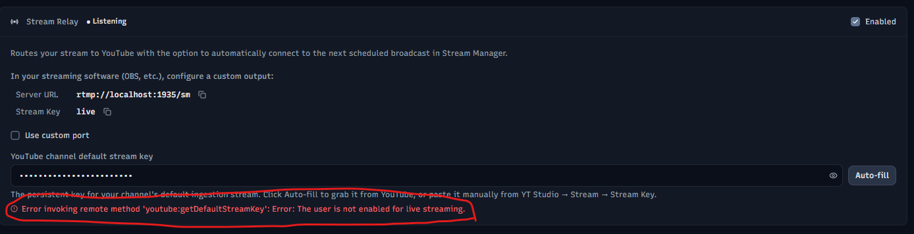

# To-Do

## Ongoing Tasks

1. Check the "processing" status of stream items after a stream to see if it's working correctly.
2. Check if the delay on the automatic Twitch update is working correctly. It should be delayed by 60 seconds after the stream relay stops.

## Discovery

* AlternativeTo listing (after 7-day account wait)
* Product Hunt listing (when ready for a possible traffic spike)
* Slant.co listing
* dev.to / Medium / Hacker News post linking to the site
* YouTube demo video with the URL in the description
* More keywords to use:
  * YouTube template manager
  * Twitch template manager
  * YouTube stream manager
  * Broadcast relay
  * Stream metadata manager
  * Stream workflow manager
  * Stream automation tool
  * Stream management software
  * Stream management app
  * Stream management system
  * Stream management solution
  * Stream management platform
  * Stream management dashboard
  * Stream management control panel
  * Stream management interface
  * Stream management utility
  * Stream management assistant
  * Stream management helper
  * Stream management companion
  * Video update manager
  * Thumbnail creator
  * Thumbnail templates
  * Thumbnail editor
  *

## Improvement ideas

(Sorted easiest → hardest.)

1. Drag-and-drop source files into stream folders. After a bulk YouTube import (which creates metadata-only stream items — details + thumbnail, no video file), make it easy to add the actual source files: make the files grid in the stream detail sidebar a drop target — dragging files from Explorer onto it MOVES them into that stream's folder (hold Ctrl to copy instead, mirroring OS drag conventions), then refreshes. Must work on EMPTY folders too: imported items have no files yet, and the grid currently renders nothing when empty, so add an empty-state drop target ("Drag video & thumbnail files here"). Add descriptive text under the files grid explaining the drop behavior. Also add a line to the import completion-summary modal letting the user know folders have been created and they can drag their source files in. Reuse the existing FileDropZone path-handling + a small "move files into folder" IPC. (We deliberately chose NOT to build an auto date-matcher for recordings — most streamers' files aren't organized enough for reliable matching, which is the whole reason SM exists; manual drag-in is the pragmatic path and the app is fully useful without the source files.). Need to consider how to handle files that are dehydrated before the move.
2. Perceptual image comparison for thumbnails, to suppress false-positive "thumbnail mismatched" flags. Today the thumbnail out-of-sync check is an exact sha1-of-bytes match against the last-synced hash, so it flags byte-level differences that aren't actually visual changes — e.g. re-saving the same image as PNG instead of JPEG, or YouTube's own recompression. Add a perceptual comparison between the local thumbnail and YouTube's current thumbnail, with a tuned threshold that ignores compression/format noise but still catches real edits (a changed text object, a moved element, etc.). This AUGMENTS the existing sha1 check to suppress false positives — it shouldn't replace the "did I change my local file" detection. Implementation notes: the bundled ffmpeg already has SSIM/PSNR + `blend=difference` filters, so SSIM is the cleanest path (no new dependency); pHash is too coarse to catch small text edits. Conceptually it's a local-vs-YouTube *visual* check (distinct from today's local-vs-snapshot hash). Gotchas: comparing against YouTube's served (recompressed) thumbnail means a "match" is never pure black, so the threshold must tolerate compression noise; normalize resolution first (YouTube serves several sizes); fetching the YT thumbnail is a public image (no API quota) but should be cached and only recomputed when the local thumbnail changes. Only needs to run for cases like swapping the thumbnail to a new file (e.g. PNG instead of JPG, otherwise identical) and a few other edge cases. Use case: When a stream item is not linked to a YouTube video, and the user links it using the linked video section in the detail sidebar footer, it will compare the set stream item thumbnail (if it has one) visually to the thumbnail assigned to the video in YouTube, and if they match below the threshold, the YouTube thumbnail file won't save into the stream item and the thumbnail field won't show as mismatched.
3. Claude integration expansion: add an opt-in web search capability to the Claude AI suggestions. Claude supports the server-side `web_search` tool, which would let tag/title/description generation ground itself in real, current info (actual game titles, trending terminology, real channel categories) instead of guessing from training knowledge. This is bigger than a config toggle — the single request/response in `claude.ts` becomes a small agentic loop (handle `tool_use`/`pause_turn` stop reasons until done), web search is metered/billed per call, and it adds latency, so it should be gated behind a per-request "search the web" toggle rather than always-on. Model selection dropdown already shipped; this is the next lever for the "tag generation feels lacking" complaint. Maybe ctrl+shift+space will auto-toggle the web search option for only the current request, so power users can quickly use it for a particular instance.
4. Investigate if it's worth adding some performance enhancements to the stream page. Since the list of stream items can be long (I already have over 200) and each one has an image, we might need to lazy load the images. We could also load in stream items in batches instead of all at once when the user scrolls past a certain point. We would want the scrollbar to accurately reflect the full number of streams. So all rows for the full number of stream items will appear, but they will be empty until the user scrolls near them. If they are within 10 items or so from being visible in the container, they will begin rendering their content.
5. Add the ability for the launcher to track which of the apps in each launch group are still open and allow the user to quit them from the launcher. Need to discuss design. We could also add more options to the launcher group items after this such as 2 boolean options: Close with group (checked by default, unchecked means it won't quit when the user clicks the "Quit Group", for example, an app that the user would like to keep open after streaming), and Allow multiple instances (unchecked by default, checked means the app could be attempted to be launched multiple times when the group or individual launch buttons are clicked. Might need to check if it's possible to know if an app can have multiple instances so there's a smaller chance of conflict. If we can, the checkbox would not appear for those apps).
6. Need to go through the onboarding process to make sure it's smooth and makes sense for all the new features we've added since th last time it was updated. (A more comprehensive overhaul is likely due, not just a review.)
7. Add ability to manage YouTube playlists in SM. Add and remove videos from playlists, create new playlists, and maybe even have the option to automatically add stream items to a particular playlist based on certain criteria (like by stream item type and topic/game tags). Add duplicate detection (which YouTube currently lacks) so if a user tries to add a video to a playlist that already contains it, it will warn the user and ask if they want to add it anyway or not. Will need a marker+link element to appear in the stream item rows to indicate that the item is part of on or more playlists, and be able to link to that playlist. Something minimal like the video counter column. Since many will not be part of a playlist, we'll need to account for empty rows. The controls for adding and removing from playlists will likely appear in the stream item detail sidebar, and maybe even a bulk action for adding/removing multiple items to/from playlists at once. Will also need to build a playlist management page that lists all the playlists for the channel, and allow the user to create new playlists, delete playlists, and edit the playlist details (like title, description, privacy, etc.). The playlist management page/modal will also need to show which videos are in each playlist and allow the user to add/remove videos from the playlist from there as well. This will likely be a big feature that will take some time to implement.
8. Maybe allow "reuploaded" livestreams (YouTube videos that were originally livestreams but have since been uploaded as regular videos) to be marked as such in the stream item details and then have the option to link that stream item to the original livestream SM stream item (if it exists in SM) so that the details can be shared between them and it can be easily navigated between the two. This would be useful for users who want to keep their livestreams and uploaded videos organized together, and it would also allow for some interesting features like automatically updating the uploaded video's details based on changes made to the original livestream item (like if they update the title or tags for the livestream, it could prompt them to update the uploaded video as well since it's now linked). This can happen if a livestream gets taken down for some reason (like copyright issues) or edited using tools not available directly in YouTube Studio and then the user reuploads it as a regular video. Maybe we do this by expanding the "linked broadcast" functionality. We can already link to livestreams and regular videos, so this would be adding the ability to link to both a livestream and a regular video. Maybe this exists in the header as a dropdown next to the archived checkbox?
9. Bulk editing of stream items. For instance, let's say the streamer has finished a game and they want to now add the "{total_episodes}" merge tag to all the stream items in that season. They could select all the items for that season and then have the option to bulk edit the title template for all those items at once. SM would swap the templates for all those streams, update the titles, and then offer to push the changes to YouTube for all those streams at once as well.
10. Maybe add the ability to connect and use other AI services in the integrations page besides Claude.
11. Add the ability for the app to update on its own without having to send the user to the GitHub releases page to download the new version. This would be a big improvement for user experience. Maybe there's a library that can handle this. We would need to set up a system for hosting the updates, and then the app would need to check for updates on startup and prompt the user to download and install (or skip) the new version if one is available (would show the release notes for the new version and any versions in between the newest, suggested version and their current version).
12. Add "clip on twitch" functionality. This is a bit more complex than the YouTube one, because Twitch clips are created through an API call that takes a start and end time, and then Twitch processes the clip and makes it available after a few minutes. We would need to have some kind of system for checking the status of the clip creation and updating the app when it's ready. We also need to make sure the user knows the limitations of twitch clips.
13. Add shorts upload functionality. Needs to be able to upload to YouTube.
14. Build a chat viewer that can connect to the YouTube and Twitch APIs to show the live chat for the active broadcast. This would be a new page in the app that shows the chat messages in real time, along with some basic info about the chat such as the number of viewers for each platform, and maybe some basic moderation tools like the ability to delete messages or ban users.
15. Create a Stream Dashboard pop-out window. This would essentially be a trimmed-down controller for SM which would show info essential for the active stream. This would be one way to show the chat messages in the item above. Additionally it could show the relay status and stats. Also the user would be able to use this to change the stream details live for all platforms at the same time (for instance if they switch games mid-stream, or come up with a better title while streaming). Not sure if this should be a separate exe that the user ca launch separately from SM if they want (it would read the same _meta.json for the info it needs) or if SM should have to be open to have it work. Would need to think through that. Would need a minimal, but effective layout & design.
16. Add analytics for stream items. They should go after the date text in the title column of the stream item rows. View count, like count, dislike count.
17. Add proper logging for the YouTube, Twitch, and Claude API calls. These will be log files located in the config directory in a logs folder. The logs should record every interaction with the APIs, including the request and response data, timestamps, and any errors that occur. Not sure what the best timeframe is for log rotation, perhaps monthly? We don't need to expose these in the UI, it's purely for advanced troubleshooting.
18. Add ability to use multiple search terms in the streams page search bar by separating them with commas. For instance, if I search for "rimworld, S2" it would search for all streams that have "rimworld" AND "S2" in their title, tags, or description. Maybe we could use a different separator like a semicolon to mean "OR" instead of "AND". For instance, if I search for "rimworld; S2" it would search for all streams that have "rimworld" OR "S2" in their title, tags, or description. Not sure how to mesh those together, maybe it's simple. If it's not simple and would require parentheses or something, then maybe we just stick with the AND search for now.
19. In the thumbnail editor, add transparency support for all color inputs, and add a clear button to set it to fully transparent (like for fills and strokes for shapes, text, drop shadows, outlines, etc.).
20. Add subtle border and drop shadow to the video player canvas so it's easier to make out the boundaries of the video when it matches the background color of the container at the edges.
21. Add the stream item title to the converter page items so it's more clear which stream item the file belongs to. This is especially important for bulk conversion tasks where there are multiple items in the queue.
22. Add the sidebar launch group functionality to the right click menu of the taskbar tray icon.
23. The "Stop" button in multiselect mode also needs the keyboard shortcut listed in the tooltip, it's the same as the one for the "Select" button that engages multiselect mode.
24. Add a total size of stream library in the streams page header next to the stream items count. Would show full amount of disk space used by all the stream items in the library (if cloud storage is being used, it would show [total disk usage]/[total actual size of all files]). Then when hovered over, a tooltip would display a breakdown of disk usage by file type: full videos (vids), clips (both shorts and regular clips), images (thumbnails assets, etc.). And again, if cloud storage is being used, it would show the [disk usage]/[actual size] of those breakdowns.
25. On the player page, while a video is playing and if the user is not presently dragging the playhead, the timeline tracks should automatically scroll to keep the playhead in view. There should be a bit of padding around the playhead so it's not right at the edge of the container. This auto-scroll and padding should also apply when skipping forward/backward with the keyboard shortcuts/player controls, and when skipping between clip segment in/out points. The auto-scroll should not happen if the user is actively dragging the playhead, and it should not happen if the user has manually scrolled the timeline tracks to a different position (while the video is paused). If the playhead is not already in view and the user takes an action that changes the playhead position, the timeline tracks should again auto-scroll to keep the playhead in view.
26. When the user is holding down a skip shortcut key on the player page, it should repeat the skip action at a reasonable interval (like 100ms) until the key is released. This should apply to all variations of the skip shortcuts with the different modifier keys.
27. In the player page session videos list, when a video file is not hydrated, clicking on it does trigger the hydration, but there's no indication in SM that it's actually happening. We need to mirror the behavior of the streams page detail sidebar files grid icons, where the icon changes to a spinner while the file is being hydrated. Also we should update the tooltip to say "Click to download this file", and "Downloading from cloud…" while it's in progress. After the file is downloaded, the player should not automatically switch to the newly hydrated file. Instead it should be called out by styling it with the same pulsing ring signifier that's used elsewhere (for instance the save button on the settings page when the user makes a change).
28. Detect empty (silent) audio tracks for the player's multi-track feature, so the track picker can flag tracks with no audio before the user extracts them. My OBS recordings always mux every configured audio channel, but several are use-case-specific channels that usually stay unused, so they exist in the file as full-length encoded silence. ffprobe metadata can't reveal this (a silent track looks identical: same duration, channel count, packets throughout), and sampling a few points won't work either, since a track might carry one brief but important sound (e.g. a single subscribe alert lasting a few seconds in a 4-hour stream) that any partial scan would miss. So detection has to cover the whole track. Two-tier approach: (1) Primary, cheap pre-check, no decode: scan compressed packet sizes across the entire track via `ffprobe -show_entries packet=stream_index,size` (one pass classifies every audio track at once). Encoded digital silence compresses to almost nothing (which is exactly why empty tracks already extract ~3x faster), while real audio, including a one-time loud alert, shows up as a spike in the per-packet sizes. Key: threshold on the MAX (or a high percentile) packet size, NOT the average/total, because a 3-second sound averaged over hours would otherwise be invisible. Caveat: it's a heuristic, defeated by a CBR encoder that pads every frame to a constant size regardless of content, but the observed 3x extraction speedup is direct evidence this OBS encoder doesn't pad, so silence is genuinely lighter in these files. (2) Certainty upgrade, piggybacked on a decode we're already doing: when a track does get extracted, run `volumedetect`/`astats` during that same decode (`max_volume` of about -91 dB / -inf means silence) and overwrite the heuristic verdict in the cache. Cache the per-file+track result mirroring the existing audioCacheManager pattern, surface an "empty / no audio" badge in the multi-track picker so empties can be skipped at a glance, and keep the flag ADVISORY (still allow a manual extract) so a heuristic miss can never hide real audio. Fits next to `probeFile` in `ffmpegService` as a `probeTrackLevels` plus a small cache and IPC, without touching the extraction path.
29. Add an additional note in the modal which appears for the hydration check when sending a video to the player that says "Pin the file local before sending to player to continue using the app while the file is being downloaded from the cloud."
30. For the player overview page recents items, there's a similar problem to the one for the session videos panel: when I clicked on a recent item to open it and all the video files were dehydrated, it properly hydrated the file and sent it to the player, but there's no indication that the file is dehydrated or that SM triggered the download. We need to show a cloud status icon next to the videos if all video files within the stream item are dehydrated. Then, when the user clicks on it, we need to show the same modal that appears when sending a dehydrated file to the player from the streams page.
31. Work on smoothing out the detail sidebar animation again.
32. CODEBASE change: add linting rules to enforce specific design decisions for this app because Claude sometimes struggles with remembering certain things. Most of the rules should be in the Claude memory files.
33. Add playback speed control to the player page. This would allow the user to change the playback speed of the video. The control could be a simple dropdown or selector that allows the user to select from a range of speeds (e.g., 0.5x, 1x, 1.5x, 2x). The selected speed should persist across sessions if possible. My other app ClpChk has this feature, and I like how that element works, but it's design doesn't quite fit SM. I'd like to have a similar functionality though: When the user hovers over the control, it expands to show the available speed options (1/4, 1/2, 1x, 2x, 4x, 8x; where 8x shows a warning saying that there may be performance issues at that speed), centered on the currently selected speed element. It can be changed while playing or paused and updates the video playback speed immediately.
34. Panning through a timeline in the player page hitches a bit when the user is dragging the timeline scrollbar or scrolling horizontally with a mouse wheel. I suspect this has to do with the thumbnail rendering. We should look into ways to improve the performance of the timeline rendering so that it doesn't hitch when scrolling or dragging. This could involve optimizing or deferring the thumbnail checks.
35. The clip items in the video sessions panel on the player page need some layout work for when they are marked as exporting (currently being encoded in the converter). The current layout has some wrapping issues and it's static. Could use a spinner and the ellipses can be removed from the chip. Also the chip should probably be a different color so it doesn't match the "shorts" chip.
36. Add the ability to collapse the asset panel in the thumbnail editor sidebar. Sometimes its not needed and it may just be a distraction or get in the way of the rest of the items in the sidebar. It would need a button to the right of the filters button in the header of the panel and would basically shrink the panel to be just the header with the button to expand it again (hiding the filters button and the list of assets). The button would toggle between collapse and expand. The collapsed state should persist across sessions.
37. In the convert-to-folder-per-stream modal, on the final step (showing the changed files), the close and undo changes buttons need to swap positions. The close button should be the one on the right in the primary location since that's the most likely next step for the user. This UX rule should be written into the style guide.
38. Update tge dump mode detection banner in the onboarding modal to a more noticeable color (like a yellow/orange) and replace the info icon with a warning icon. Then add "(Not recommended)" to the end of the text. This is to make it more clear to the user that this mode is not recommended and they should consider switching to folder mode.
39. Add a "combine" button to the stream page detail side bar files grid when in the multi-select mode. This would allow the user to pick video files to send to the combine page, so they don't have to add all and remove from there.
40. The converter page needs a layout overhaul. The items in the list have no details aside from the file name and the duration timecode. They need to be updated to include a thumbnail, the stream item title, and the stream item date, format, resolution, and duration. We also need to show a file dropper, so it can be used with external files. It should match the one for the converter page when the page has no items, changing to a slimmer version when items are added to the list. There needs to be a "clear all" button in the header which till clear the list. The options for the process should mirror the layout & design of the converter page instead of being placed in a footer component whose design matches nothing else in the app. We'll start there and add more as we build.
41. Add the ability for the user to start with a template and then save the thumbnail to a stream item after. This would only appear if the user starts with a thumbnail template. This would only be a change in the template editing version of the thumbnail editor. When the user clicks a thumbnail template item from the thumbnail overview page, it opens the thumbnail editor, but the user may have wanted to explore ideas starting with a template and then assign the thumbnail to a stream item afterwards. This functionality would start with a button in the editor header (in the same location as the thumbnail selector dropdown in a normal thumbnail editing session). The button will open a modal that shows a slim version of the stream item list (just the thumbnail, title, and date. And maybe the tags if there's space). There would also need to be a search bar to filter the list. The user would simple click on a stream to select it and then click the save to stream button at in the bottom of the modal. Then this would open the thumbnail in the regular thumbnail editor session and save the files to the selected stream item. The file would no longer be template.
42. Add support for different audio language options for stream items to sync with the field in YouTube (and possible Twitch, need to see how that works). Possibly a "default language" setting in the settings page for the user to set their default language for new stream items and an override option in the stream item details sidebar to change it for a specific stream item. This would be useful for users who stream in multiple languages or want to set a different language for a specific stream item.
43. Refactor streams:changed to folder-scoped reloads: events carry the stream key (relativePath), main re-scans just that folder, renderer splices it into state. Full reload only for structural changes (create/delete/reschedule) + a quiet idle reconcile (no thumbnail flash unless a folder actually changed). Includes a per-path echo registry so SM's own writes stop triggering watcher reloads. Dump mode keeps full-scan behavior. (Foundation already shipped: defer-and-coalesce suppression + slow-list token.)
44. Onboarding: properly explain dump-mode drawbacks (second-class mode, reduced feature set, full-scan refreshes) and steer users toward folder-per-stream.
45. Need to add a way to show when clip drafts exist for a stream item. I think the best place for these would be in the files grid.
46. Move the "start blank" button for the thumbnail variant creation modal into the same grid list as the templates and "copy of current" options. Then instead of just clicking on one of the options and having it open the new file in the editor, the modal will have a create button at the bottom that will be disabled until the user selects one of the options.
47. When the user clicks on a stream item in the streams page list, it opens the stream item detail sidebar. But if the user is holding the shift or ctrl key when clicking a stream item, it should turn on multi-select mode and select that stream item. This should also apply to all places where multi-select mode is available and a toggle (like the files grid in the stream item detail sidebar).
48. Look into improving the performance of the app as a whole. Is there any styling or other visuals that would tax the user's hardware unnecessarily for not much actual UI/UX gain? Is there a way to optimize the current visuals so the calculations are less taxing on the user's hardware? Are there any other ways to improve performance without sacrificing the current design and functionality of the app? Would it be useful to add a "performance mode" option in the settings page that would reduce the visual effects and other taxing features of the app to improve performance on lower-end hardware? Would allowing the user to disable hardware acceleration in the settings page improve the experience of some users?
49. Add wrong-Google-identity guidance to the instructions accordion in the YouTube section of the Integrations page. During authorization, Google's "Choose an account" step lists the personal Google account AND any brand-account channels it manages — picking the personal account connects a channel that has never enabled live streaming, so every `/liveBroadcasts` call 403s with `liveStreamingNotEnabled` while id-based video lookups keep working. The symptom is confusing: past videos/VODs look fine but upcoming scheduled broadcasts never load (and the linked-broadcast footer gets stuck with no Unlink button, blocking the paste-URL fallback). Hit this for real on the 2026-07 machine rebuild. The accordion should tell users with a brand-account channel to pick the entry showing their CHANNEL name/avatar at that step, not the bare Google account. Related hardening (same failure class, discussed with Claude): (a) surface the `liveStreamingNotEnabled` 403 in the UI with reconnect guidance instead of console-only — the bulk broadcast load throws correctly but the renderer only console.warns it, and the per-id `getBroadcastById` fallback swallows it entirely; (b) detect the wrong channel at connect time by comparing the newly-authorized channel id against the `channelId` of an already-linked video and warn on the Integrations page immediately; (c) always offer Unlink in the linked-broadcast footer when a `ytVideoId` is set, even when it can't be resolved, so the escape hatch stays reachable.
50. Add the ability for a user to backup their Stream Manager setup so there can be an externally saved file that can restore their settings, templates, etc.
51. Add a "retry" button in the cloud sync modal when items fail. This will attempt to retry either the pin local or offload commands. Should appear as a small clockwise arrow icon next to the fail label (on the left side).
52. For combining files of different dimensions, we need to give the user options of how they are combined. Whether the videos are cropped or whether bars are added, whether the final file gets the max framerate or min framerate (or some custom framerate), and need to explore other options.
53. Allow the combine page to accept multiple sets of file combines from different stream items in a queue-like system. We'll display this by grouping the stream items similar to how we group the queue and converting items in the converter page (items from the same stream items will live in the same group). Each group will get their own combine button, output location options, encoding options (if the user wants something different besides just a straight copy), and a remove group button which removes all items in the group and the group wrapper. Items will need to be able to be dragged inside of and *between* these stream groups (in case the user wants to combine video files from different stream items). When a group contains files from different stream items, and the user is using the "same as source" for the output location, it will continue to use whichever stream item generated the group. If the user moves the last item belonging to the stream item that also belongs to the group (and if any items remain that all don't belong to the stream item group), we need to show a warning saying something like "no items in this combine group belong to the stream item for the group" and the combine button will disable. If a group becomes empty (all files dragged out or removed), all the group's items will get disabled except the remove group button.
54. Combine page rich list items (complements #52 dimension options and #53 grouping): use the converter page as the design reference — thumbnail, owning stream item, and encoding & file details (codec/resolution/fps/size) per row, plus a Clear All button and a file dropper for external files. Implementation note for #52: the clip-export segment normalization in converter.ts (~1191-1371) is in-house prior art — unified-dimension scale, square-pixel forcing before its concat — and the option could surface as a one-click "normalize mismatched files" offer on the compatibility gate. Until #52 ships, the gate (added 2026-07-12) hard-blocks combinations that would produce a broken -c copy output (video codec / resolution / audio layout mismatch) and amber-advises on frame-rate-only drift (VFR output, plays fine).
55. Thumbnail editor: need to add subtle layer bounds lines around layers when they are part of a group selection, so it's clear what is selected on the canvas when there's multiple items, some of which could entirely encompass other layers (making it impossible to tell if they're selected without looking at the layer panel and know which item there matches with the element on the canvas). The bounds lines should be dashed to imply that they are part of the selection. Additionally, we should have subtle layer bounds highlighting on hover for elements on the canvas, so it's more clear which item is being hovered as the user moves their cursor around in the canvas, also subtly highlight the layer in the layers panel in the sidebar so it's clear which layer item matches with the element on the canvas. So element bounds should have 5 bounds states with 4 styles (including the *no-bounds* state):
    a. Not selected, not hovered: no styling
    b. Not selected, hovered: solid bounds lines, lighter than default bounds lines, no handles
    c. Selected (single item), hover state irrelevant: Current bounds styling with handles
    d. Selected (as part of a group), not hovered: dashed bounds lines (this will apply to the largest encompassing element as well, but some or all sides might be obscured by the group bounds with handles, this is okay, just need to make sure the group bounds is the top-most object in the visual stack, so it is never obscured)
    e. Selected (as part of a group), hovered: solid bounds lines, lighter than default bounds, no handles
56. Gradient options for thumbnail editor. Need to discuss: where the gradient options live, whether we enforce oklch or allow user to pick.
57. Palette colors panel for thumbnail editor. Need to discuss: if we allow for multiple palettes to be created or just have the one that's available for all stream items. Where it lives and how its accessed.
58. Quick-cropping and masking for images in the thumbnail editor. We'll keep it simple at first: just using the simple shape elements already available in the thumbnail editor (rectangle, circle, triangle), allow the user to apply them as a mask to other layers in the layers panel with a button in the shape row (to the left of the duplicate button) which will say "Apply as mask to the layer below" in its tooltip, then, when clicked, the mask layer will become a sub-layer of the layer it was above, and mask that layer. It will only care about the vector lines for the shape layer for now, if the pixels are inside the vectors, they show, otherwise, they do not (so the color/opacity/filters/drop shadow of the shape layer will not be taken into account).
59. Rounded corners for rectangle and triangle default shapes in the thumbnail editor. This will be a new field under the size/position fields in the properties panel in the sidebar. For now, we just need perfectly circular rounded corners. They should stay perfectly circular regardless of any scaling the user does to the shapes before or after the rounded corner radius is applied (and if possible also during scaling in the canvas, so they don't stretch and then bounce back to perfectly circular)

## Bugs

(Sorted easiest → hardest, 2026-07-12.)

1. The close button for the launcher sidebar needs to be styled like the other close buttons throughout the app, for instance the detail sidebar on the streams page.
2. Messages in the relay widget are getting cut off by the narrow width of the widget. We need to make sure a tooltip appears when the user hovers over a message that is too long to fit in the widget, so they can see the full message. and we should make sure that the text gets truncated properly with an ellipsis when it doesn't fit in the widget, so the user knows this is happening.
3. After connecting YouTube to a new instance of the app for the first time, I had to restart the app for the YouTube-related stuff to start being detected (privacy status for videos, linked broadcast section in the stream detail sidebar footer, etc.). We should prompt the user to restart the app when connecting a service that requires a restart. *(Claude: better than a prompt — broadcast a 'connected' event from main on OAuth success and have the pages re-run their bootstrap live; no restart needed at all.)*
4. The spinner for a "processing" stream item in the stream item row tag starts showing on a "today" stream item before the stream has even started, but it's only relevant for streams that have finished and are still processing on YouTube's side. The spinner should only show for streams that have finished and are still processing, not for streams that haven't started yet. We need to check for if the stream actually happened yet and if it has finished before showing the spinner.
5. I tried adding some AI suggestions in the description of a stream item and the results returned nothing. I tried several times and no text was entered each time. This may be a UI bug or the AI responding with nothing for some reason. *(Claude: suspect a swallowed error — possibly the rotated API key/model on the rebuilt machine; either way any failure must surface instead of rendering as empty ghost text.)*
6. There seems to be a disabled loop in the stream relay initial setup. The user cannot auto-fill the default stream key while the relay is disabled, but they cannot enable the relay without the default stream key. Additionally, the error doesn't seem to disappear once the stream key is filled and the relay is enabled successfully 
7. When a user is using a font in the thumbnail editor for a text layer, and the font is no longer available on the machine, we need to show a warning saying the font is not available and encourage them to select a different font.
8. Upon opening the app for the first time on a new machine and selecting my library location. It seems like the cloud detection didn't work properly. Some things worked, like showing the cloud icon on dehydrated images, but the cloud action buttons did not appear for anything, stream items, files grid items, etc. I had to restart the app for them to appear.
9. After hydrating several files including stream item selected thumbnails on first run using Stream Manager's "pin local" functionality (during normal use, these thumbnail image files are "pinned", meaning they never get offloaded by Stream Manager), the thumbnails did not update in the stream list on the streams page after the files were completely hydrated. Instead they continued to show the cloud icon. Once a stream item's selected thumbnail is hydrated, it should load in to the proper place in the stream item list row it belongs to on the streams page. I had to manually refresh the streams list to get them to appear. *(Claude: adjacent to the sweep's hydration-icon fix — that made the file-card icons live; the list-row thumbnails still read scan-time flags.)*
10. While I have a stream item video open in the player, and I click the open video file button and then open an external video, the previous stream item video is not listed in the recent items list when I close the session. Instead only the external video shows.
11. Lots of bugs in the thumbnail editor, especially when it comes to selecting, resizing, and moving multiple layers.
    a. Unable to ctrl/shift click in the layers list panel in the sidebar to select multiple layers
    b. When moving multiple layers, some of the layers *stick* to snap points when other layers in the same selection don't, causing the layers to shift position relative to each other.
    c. I'm not sure what happened with this one: First I selected a group of layers, 3 images, then I moved them, then I flipped all 3 horizontally with the button in the toolbar. Then I changed the layer order of one of the layers I just flipped. Then I used the undo shortcut. The image in question jump to it's previous location before I had moved it as part of the group, and it was no longer flipped, but the toolbar button still showed it was flipped (and clicking the button did not fix it, the image was no longer able to be flipped at all). I closed the thumbnail session and reopened it and the image was flippable again, but it was still in the wrong place.
12. When sending a clip to the converter for export, the new clip file is available immediately in the files grid in the stream item detail sidebar and the session videos panel on the videos page (and though it shows as a clip in the session videos panel, it does not show as a descendant of the source file), and both sites treat it as a normal video file. It should not be available until the export is complete or at the very least, interaction with it should be disabled (thumbnail generation should not trigger, all action buttons should be disabled in the files grid, should not be clickable in the session videos panel) until the file is finished. Once the file is finished, it does show properly as the child of the source file in the session videos panel.
13. When a stream item has more than one topic / game, and it's part of a series, the episode auto counter should only consider the *primary* (selected in the tag field) topic / game as the series subject. Currently, it seems to be using both or at least it's not clear which one it's actually using. I have a series on the game The Alters, and part one of that game is in a 2-game stream item along with part 10 of Beat Saber. But the app is detecting this as part 10 of "The Alters", making there be 2 part 10 items. This also somehow caused the "next episode" stream item to automatically use 10 as well (instead of 11) for some reason. SM did grab the correct stream item for the `{season_links}` merge field, but that was probably just by happenstance (or perhaps the logic for that functionality is better?).

## Other ideas (small)

1. Stream stats surface (location TBD — probably NOT the streams page sidebar; that's high-visibility real estate better used for workflow surfaces). Stream count, total hours streamed, top games/topics per month/year, longest stream, most-streamed game of all time, etc. Could live in its own page, a stats modal accessible from the streams page header, or a small "year in review" type card on the dashboard/launcher page.
2. Series momentum panel — likely lives in the streams page sidebar empty-state (alongside the planned month calendar). Lists active series (with at least one episode in the last N days) with last-streamed date + episode count, plus stalled series (last episode > 30d ago, never marked complete) with a "resume?" badge. Click a series → filter the streams list to it. Prerequisite: a way to mark a series as COMPLETE so finished games don't show up as stalled forever. Needs a new per-series "completed" flag (probably keyed off the game/topic tag, since series are inferred from {game, season}). UI for marking complete is open — right-click context menu on the panel entry, an action in the per-stream sidebar's metadata section, or a dedicated "series manager" view. Whatever shape it takes, "completed" should also influence the series-nav buttons in the detail sidebar header (last episode of a completed series shouldn't show a next-arrow that goes nowhere).
3. Maybe add a button to a completed conversion task to send the source and output files to my other app ClpChk if it's detected on the user's machine. Since it's a deployable app, I may need to update it to add a registry key or something to indicate its location for other apps to find it. This button would send the current stream item or video file to ClpChk for checking and fixing any issues with the clips before uploading.
4. Add the ability to read markers from video files and display them in the player page's timeline. Also add the ability to add new markers while a video is open in the player. These markers should mirror the functionality of those in DaVinci Resolve, allowing the user to add a marker with a specific color and name, and then be able to click on those markers to jump to that point in the video. They should be triangular, pointing down to a particular point in the timeline, and when hovered over, they should show the name of the marker (if the user added one). Single clicking should place the playhead at the marker, and double clicking should open a popup above the marker which is where the user can change the color, name, and specify a new placement timecode. It would be great to integrate these with a merge field for the YouTube description so that the user can add a merge field for each marker and it will automatically populate the description with the marker name and timecode. This would be useful for streamers who want to add chapter markers to their videos for easier navigation.
5. More merge fields for the stream item details. A snippets manager (basically user-created merge fields). Snippet examples:
   1. Collaborators (like co-streamers or guests), names & links to profiles
   2. Game links like to the store page and their marketing descriptions
   3. Links to the streamer's social media accounts (like Twitter, Instagram, TikTok, etc.) or to their own website or other related stuff.
6. Add a main process console viewer for the production version of the app, accessible with a keyboard shortcut.
7. Maybe add a "streaming mode" that detects if there's an app that's currently recording (like OBS, Xsplit, or StreamLabs). This would allow the app to adapt in order to obscure sensitive info and perhaps even enter into a streamlined UI.
8. Relay feature ideas:
   * Add the ability to allow to the stream relay to add a "technical difficulties" fallback image so if the stream app (like OBS) crashes or the signal fails, it will instead push that image to YouTube as a backup until the stream app reconnects.
   * If it's possible to integrate Twitch's enhanced broadcast mode, allow the relay to send to multiple platforms (just Twitch and YouTube for now) at the same time
   * Allow the user to manage the editable details for each platform straight from SM. Maybe they change up what game they're playing or topic they're doing or otherwise what to flexibly update the details while streaming or right before.
9. Since SM can be used for normal videos as well as streams, we may need to adjust some things to make it seamless for users who want to use SM, but don't stream. For instance renaming the "Streams" page to "Videos".
10. If possible, we should attempt to measure and store the time it takes for files to hydrate from the cloud. After enough samples, we could use that data to estimate how long it will take to hydrate a file based on its size and the user's connection speed. We could then add this estimate to the various tooltips, & modals where hydration is involved. This would give the user a good idea of how long it will take to hydrate a file before they start the process, and they can plan accordingly. Since it's not possible to actually track the connection speed or the actual rate of download while its happening, we would make it clear that this is a rough estimate somehow. If multiple files are being downloaded it once, the estimates would probably be very inaccurate (for instance when pinning several items local at the same time).

## Other ideas (big)

1. Maybe a music folder manager as well? To control and add info to the music that's played during streams through OBS.
   * Not sure if it should play through the SM app or just manage the files and the metadata for the music that's played through OBS.
   * Maybe it could serve a custom web page that displays in OBS as a browser source that shows the current track info and maybe even the album art or something in a customizable layout.
   * The biggest add for me would be a way to group music items into playlists so I can easily switch between different sets of music for different types of streams or different moods. This way, I won't have to manually edit the settings of the OBS music source every time I want to change up the music.
   * Maybe one day, there could even be a feature that allows the user's audience to vote on what music they want to hear during the stream through a Twitch extension or a website. And maybe even rate the music or suggest new tracks to add to the playlists. This would be a fun way to engage with the audience and make the music selection more interactive.
2. Add the ability to switch between different YouTube channels from within SM. This would mean switching the root folder that SM is monitoring for stream items, as well as switching the YouTube account that SM is connected to for uploading and managing the streams. This would be useful for users who manage multiple channels or want to separate their content into different channels. The user would need to go through the YouTube integration process for each channel they want to connect, and then they could easily switch between them in the app through a dropdown in the app window header next to the app title. Not sure how this would affect twitch, maybe the option to tie a particular Twitch account to each YouTube channel so that when you switch channels, it also switches the Twitch account that's connected for the stream relay and chat features.
3. For the thumbnail editor: add the ability to search for and insert graphics related to a game. Utilizing a service such as SteamDB & SteamGridDB or another game database API, the user could search for a game and then pull in official assets like logos, character renders, screenshots or other promotional images to use in their thumbnails. This would save time for streamers who don't want to have to search directly.
