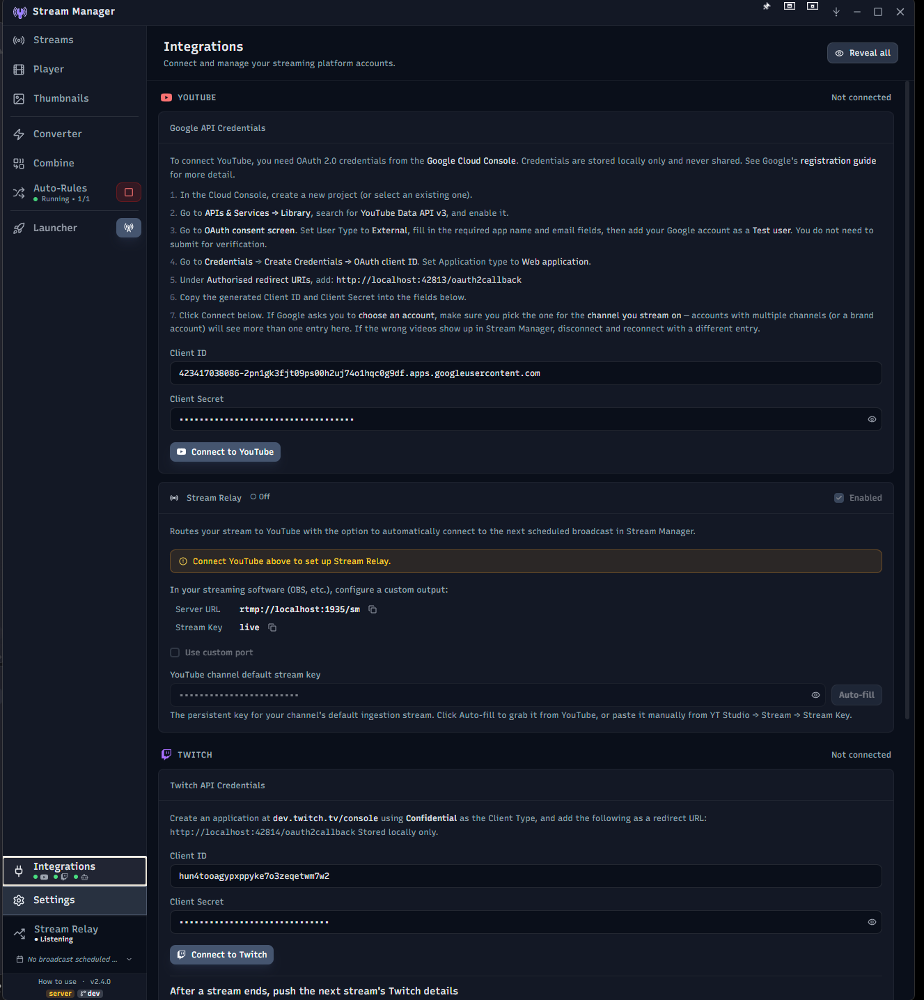
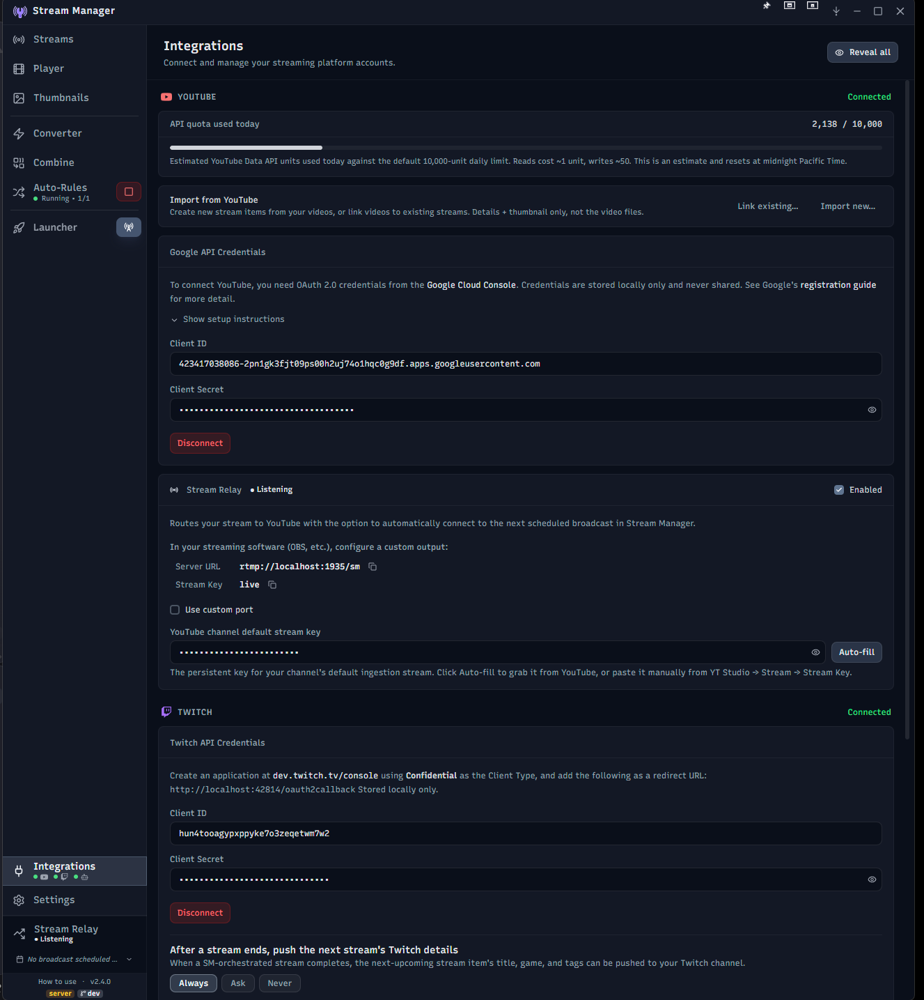

# To-Do

## Improvement ideas

### Streams page

1. Add ability to open the files grid for a stream item in a large modal so the user can have a bigger workspace for managing the files for a stream item.
2. Add a total size of stream library in the streams page header next to the stream items count. Would show full amount of disk space used by all the stream items in the library (if cloud storage is being used, it would show [total disk usage]/[total actual size of all files]). Then when hovered over, a tooltip would display a breakdown of item counts & disk usage by file type: full videos (vids), clips (both shorts and regular clips), images (thumbnails assets, etc.). And again, if cloud storage is being used, it would show the [disk usage]/[actual size] of those breakdowns.
3. Add analytics for stream items. They should go after the date text in the title column of the stream item rows. View count, like count, dislike count.
4. Investigate if it's worth adding some performance enhancements to the stream page. Since the list of stream items can be long (I already have over 200) and each one has an image, we might need to lazy load the images. We could also load in stream items in batches instead of all at once when the user scrolls past a certain point. We would want the scrollbar to accurately reflect the full number of streams. So all rows for the full number of stream items will appear, but they will be empty until the user scrolls near them. If they are within 10 items or so from being visible in the container, they will begin rendering their content.
5. Add a new organization element to the files grid. Not sure what to call it... maybe "advanced" or "nested" or "structured". It will show files which are inside of sub folders within the stream item folder grouped inside an accordion element inside the files grid. The accordion will be a narrow full-width row that shows the folder name and a count of the files inside and the cloud/delete action buttons which will affect all items inside the subfolder. When the user clicks on the accordion, it will expand to show all the files inside that folder as normal file items with a wrapper around the group. Folder accordions should start collapsed by default. This will only be used to view the structure that a user may have, and will most likely be used for items that were imported from their library before the use of SM (or for stream item folders that required organization beyond what SM currently offers, for example, a charity stream I did required that I download a bunch of assets from the organizers. The best place to put these were in the stream folder, but I only used a few of them. Currently all these assets show up in the files grid and clutter it up). When the accordion is collapsed, we can skip rendering of these file item elements, their thumbnails, metadata, cloud status, etc. Only when the accordion is opened would we pull that info. We may extend this functionality to allow users to create subfolder directories within SM, but considering the simplicity of SM's functionalities, I'm not sure that will be useful. It would require adding drag-and-drop/cut-and-paste functionality. At that point we're rendering a lot of the automatic "magic" of SM useless, and it would be better to just use a file manager for that. So for now, this will be a read-only view of the subfolder structure within the stream item folder.
6. Bulk editing of stream items. For instance, let's say the streamer has finished a game and they want to now add the "{total_episodes}" merge tag to all the stream items in that season. They could select all the items for that season and then have the option to bulk edit the title template for all those items at once. SM would swap the templates for all those streams, update the titles, and then offer to push the changes to YouTube for all those streams at once as well.
7. When hovering over the date button at the top of the stream item detail sidebar, let's show the calendar inside the tooltip (under the "click to reschedule" text). This would allow the user to see the calendar without having to click on the button or close the detail sidebar, for quick reference. It should highlight the current date and highlight (differently) the date of the stream item. The user will not need to be able to enter the tooltip calendar, it's just for reference.
8. Since the date field in the stream item detail sidebar is a button at the very top of the sidebar, it's difficult to remember where to look when the user wants to create a YouTube broadcast and make sure the date is correct before pushing. We should replicate the button in the footer as the first item in the create broadcast row. That way the user can change the date there as well. The button will have the exact same functionality as the one in the sidebar header. In fact, let's discuss moving the button to the footer and removing it from the sidebar header. The footer is more visible and easier to access, and it would be more consistent with the other buttons in the footer. It may be worth just having it twice, because if YouTube is inactive (which means the create broadcast row is not shown), the user still needs to be able to change the date of the stream item.
9. Extend the new-episode thumbnail re-render (shipped for the created episode) to the rest of a series: when a merge field that affects sibling episodes changes (like {total_episodes} growing as episodes are added, or edits to {topic} or {title}), re-render the SM thumbnails of the other affected episodes so they stay accurate too. Considerations:
    a. This can be a lot of processing for large libraries, so it should probably be a settings toggle or an explicit prompt rather than automatic.
    b. Re-rendered thumbnails for episodes already uploaded would also need a bulk thumbnail push to YouTube.
10. Add a new step & functionality to the new episode creation modal. This will allow the user to choose which fields will carry over to the newly created episode. For example, the user may want to carry over the title template, tags template, and thumbnail template, but not the description template. We should show checkboxes for all the relevant items that the user may want to copy over. We should have some checked by default and the selection should be remembered in the user's settings so the same selection is auto-checked for future new episode creations. Fields:
    * Thumbnail
    * thumbnail template (this would need to apply a blank version of the template that the episode being copied had, this would need to be mutually exclusive with the thumbnail checkbox) [checked by default]
    * Stream Type [checked by default]
    * Topics/games [checked by default]
    * series [checked by default]
    * YouTube title
    * title template [checked by default]
    * Tagline
    * Description
    * description template [checked by default]
    * youtube tag templates
    * twitch tag templates
11. Add a hover/focus interaction to the inline stream type and topics/games tags in each stream item row on the streams page. This interaction will animate the tags so their width increases to reveal an icon-only button. This button will be a "filter by this tag" action which will allow the user to quickly filter the stream item list based on the tag whose button was clicked. The icon should be a filter icon and the tooltip should read "Filter stream items by this tag". When the list is filtered, this icon will switch to a clear filter button with tooltip reading "Clear this tag from filters." When filters are applied, all tags in stream items which are matched with the filters list will have this button revealed already without needing to hover/focus. That way the user also has an easy way to identify and clear the filters from the using the tag chip elements. The filter status will need to sync with the actual column filter menu. So if the user filters by a tag using the column filters menu, all the tags which match a checked tag field in the menu will reveal the "clear this tag" version of the button.

### Player

1. Add a button in the multi-track audio mode (on the right in the same row as the disable button) which says "Setup tips" with a circle question icon. It would open the help modal to a specific section that explains how to use the multi-track audio mode and how to best set up their OBS/Xsplit/StreamLabs to get the best results (which we also need to create). This would be useful for users who are new to multi-track audio and may not know how to set it up properly. The general advice would be to use track 1 as the full audio mix (the same way they send it to the stream platform), and then use the other tracks for specific audio sources (like game audio, music, microphone, etc.) so that they can be extracted and used in the clips. The help modal would also explain how to use the multi-track audio mode in SM to extract the specific tracks they want to use for their clips.
2. The enable multi-track audio button needs a tooltip. It needs to explain that it opens the multi-track audio mode, and that the user can then select which tracks they want to extract from the video.
3. Add shortcut options to the remaining default skip buttons. This was skipped at first because I was unsure which ones to use. Alt is obviously available, but what's the correct combination? alt+ ->/<- for 1m and alt+shift+ ->/<- for 10m? Or alt+ctrl+ ->/<- for 1m and alt+shift+ ->/<- for 5m? Or something else? Whatever we choose, the tooltips and animation will need to be updated to include these new shortcuts.
4. Panning through a timeline in the player page hitches a bit when the user is dragging the timeline scrollbar or scrolling horizontally with a mouse wheel. I suspect this has to do with the thumbnail rendering. We should look into ways to improve the performance of the timeline rendering so that it doesn't hitch when scrolling or dragging. This could involve optimizing or deferring the thumbnail checks.
5. Detect empty (silent) audio tracks for the player's multi-track feature, so the track picker can flag tracks with no audio before the user extracts them. My OBS recordings always mux every configured audio channel, but several are use-case-specific channels that usually stay unused, so they exist in the file as full-length encoded silence. ffprobe metadata can't reveal this (a silent track looks identical: same duration, channel count, packets throughout), and sampling a few points won't work either, since a track might carry one brief but important sound (e.g. a single subscribe alert lasting a few seconds in a 4-hour stream) that any partial scan would miss. So detection has to cover the whole track. Two-tier approach: (1) Primary, cheap pre-check, no decode: scan compressed packet sizes across the entire track via `ffprobe -show_entries packet=stream_index,size` (one pass classifies every audio track at once). Encoded digital silence compresses to almost nothing (which is exactly why empty tracks already extract ~3x faster), while real audio, including a one-time loud alert, shows up as a spike in the per-packet sizes. Key: threshold on the MAX (or a high percentile) packet size, NOT the average/total, because a 3-second sound averaged over hours would otherwise be invisible. Caveat: it's a heuristic, defeated by a CBR encoder that pads every frame to a constant size regardless of content, but the observed 3x extraction speedup is direct evidence this OBS encoder doesn't pad, so silence is genuinely lighter in these files. (2) Certainty upgrade, piggybacked on a decode we're already doing: when a track does get extracted, run `volumedetect`/`astats` during that same decode (`max_volume` of about -91 dB / -inf means silence) and overwrite the heuristic verdict in the cache. Cache the per-file+track result mirroring the existing audioCacheManager pattern, surface an "empty / no audio" badge in the multi-track picker so empties can be skipped at a glance, and keep the flag ADVISORY (still allow a manual extract) so a heuristic miss can never hide real audio. Fits next to `probeFile` in `ffmpegService` as a `probeTrackLevels` plus a small cache and IPC, without touching the extraction path.
6. Clicking on the timeline track within some distance from the edges seems to auto-scroll the track instead of placing the playhead. It seems to be whenever the click happens within the auto-scroll margin of the playhead. This needs to be fixed.
7. In addition to the fix above, we need to make it so that if the user left clicks on the timeline track and holds down and drags, it should place and scrub the playhead. Currently, if the user clicks and drags, it does nothing.
8. Add a keyboard shortcut for toggling the multi-track audio mode (split out of the tooltip item above; the tooltip ships with the UI-polish batch, the shortcut does not). Candidate: ctrl+shift+m. The button's tooltip gains the shortcut hint when this ships.

### Thumbnail editor

1. Quick-cropping and masking for images in the thumbnail editor. We'll keep it simple at first: just using the simple shape elements already available in the thumbnail editor (rectangle, circle, triangle), allow the user to apply them as a mask to other layers in the layers panel with a button in the shape row (to the left of the duplicate button) which will say "Apply as mask to the layer below" in its tooltip, then, when clicked, the mask layer will become a sub-layer of the layer it was above, and mask that layer. It will only care about the vector lines for the shape layer for now, if the pixels are inside the vectors, they show, otherwise, they do not (so the color/opacity/filters/drop shadow of the shape layer will not be taken into account).
2. Maybe... drop the triangle & square shapes and add a new "polygon" shape tool which will allow the user to create a shape with any number of sides. It will default to a square, but a new input would be available in the properties panel to change the number of sides.
3. Add a new interactive element for the shape layers which will allow the user to change the corner radius of the shape layer by dragging a handle on the canvas. The handle would be a small circle that appears on the corner of the shape layer when it is selected. The user can click and drag the handle to change the corner radius of the shape layer. The handle would only appear when the shape layer is selected, and it would disappear when the layer is deselected. The handle would also have a tooltip that shows the current corner radius value as the user drags it. This would allow for more intuitive and interactive control over the corner radius of shape layers, rather than having to enter a value in the properties panel.
4. We need to update the help section for the thumbnail editor to include information about the current feature set. I'm debating whether to explain fully as an image editor or just the things that are relevant to the stream manager workflow. We don't need to get detailed on how it works in terms of image editing, but we should explain the features that are available and how to use them in the context of creating thumbnails for stream items, how they are connected, and how to manage them.
5. If possible, we should expose controls for variable fonts. We would need to detect if the font is a variable font and then expose the controls for the axes that are available for that font. This would allow the user to have more control over the appearance of the text in the thumbnail editor. These would need to be exposed in the properties panel for the text layer, and would be a set of sliders for each axis that is available for the font. They should live in a collapsible section (collapsed by default) so that users who don't use/understand variable fonts aren't overwhelmed with options. The sliders should update as other properties are changed, and the text on the canvas should update in real-time as the sliders are moved. The design should match the other sliders in the properties panel. We should also add a tooltip to each slider which explains what the axis does and how it affects the appearance of the text (if that info is easily discernable).
6. Layer locking. A lock toggle on layer rows (and maybe the canvas context menu) that makes a layer immovable/unselectable on the canvas — for anchor elements that live in the same spot in every thumbnail and must never be nudged (e.g. a standing logo/frame). Locked layers still render normally and stay editable from the layers panel (unlock to move). Needs: lock state persisted in the canvas JSON, canvas hit-testing disabled while locked (listening off), Transformer refuses to attach, and a subtle lock icon on the layer row. Decide whether locked layers should still hover-highlight (probably yes — knowing what a thing is matters even when you can't move it).
7. Add a subtle text link below the font family dropdown in the properties panel for text layers which will show the last used font family in the thumbnail editor. This will allow the user to easily pick the last used font family without having to scroll through the list of fonts. The link should say "Last used: [font family]" and when clicked, it will set the font family of the selected text layer to the last used font family. The last used font family should be stored in the app's settings so that it persists across sessions. If the user uses the dropdown and picks any font family, the link will hide and that font will then be the last used font family.
8. Multi-stop gradients (3+ stops): extends the 2-stop gradient shipped 2026-08-01. Most of the groundwork already generalizes: `gradientStops` is an array, `buildKonvaColorStops` (lib/gradient.ts) samples every consecutive pair, `cssGradientPreview` maps all stops, and the preview bar's SVG arrow track derives its height from `stops.length`. What's missing is purely the editing UI in `GradientFillControl`:
    a. An add-stop affordance. Clicking the preview bar is the natural one; the click's Y gives the new stop's position directly.
    b. A per-row remove button (floor of 2 stops).
    c. A sensible color for a new stop: sample the existing gradient at that position (`mixOklch` already does exactly this, it just isn't exported).
    d. Bundle with drag-the-marker-directly-on-the-bar: typing coordinates is the weak part of the current editor, and direct manipulation is what makes 3+ stops actually pleasant.
    Design decision to keep: rows stay in ARRAY order and don't re-sort live as positions change (re-sorting makes rows jump under the cursor mid-edit); the arrows already point at true positions regardless of row order, and both the renderer and the CSS preview sort internally. Note the SVG track's ROW/GAP constants (24px / 6px) are tied to the color-row height; update them together if the row styling changes.
9. Gradient strokes for shapes & text: noticed right after the 2026-08-01 gradient-swatch freeze; scoped out only because the shipped gradient feature was specced as gradient *fills*. No engine blocker: `strokeLinearGradientStartPoint`/`EndPoint`/`ColorStops` live on Konva's `Shape` base class (Text included), and the existing pipeline is direction-agnostic; `buildKonvaColorStops` (oklch pre-sampling) and `gradientLinePoints` (angle geometry) drive a stroke identically to a fill. Work needed:
    a. Parallel layer fields (`strokeType`, `strokeGradientStops`, `strokeGradientAngle`, `strokeGradientColorSpace`).
    b. Generalize `GradientFillControl` into a property-agnostic paint control: it's already shared by shape and text fills, it just needs to be told which layer fields it reads/writes, its label, and which tie key to use (`layerId:stroke-gradient`). The swatch system then works for free (ties are keyed per property, and the gradient drop target/popovers come with the control).
    c. Mirror the fill's Konva gradient branch onto the stroke props.
    EXCLUDED: the text *outline* effect. That's the alpha-dilation filter stamping a single color, not a canvas paint; a gradient outline is a different (hard) problem and stays out of scope.
10. Radial gradients for shapes & text: the other half of the gradient feature (linear shipped 2026-08-01). Adds a third `fillType` ('radial') alongside 'solid' and 'linear'. Main use for thumbnails is vignettes / spotlight glows behind a subject.
    a. Konva side: `fillRadialGradientStartPoint` / `EndPoint` / `StartRadius` / `EndRadius` / `ColorStops`, reusing the same stops array and the same oklch pre-sampling from `buildKonvaColorStops` (the color math is direction-agnostic; only the geometry differs).
    b. Geometry: the linear endpoint helper (`gradientLinePoints`) does NOT apply. Radial needs a center + radius in the shape's local space, with the same centered-ellipse origin shift the linear path already handles, and for text the measured text box.
    c. UI: swap the Angle field for center X/Y (as a % of the layer box, so it survives resizes) and a radius control; the vertical preview bar should probably become a square radial preview instead (CSS `radial-gradient(... in oklch, ...)` previews natively, same as the linear bar does).
11. Allow swatches from the recent list to be dragged into the saved palette list. When the user drags, they should be able to drop the swatch in between any two existing swatches in the palette list, and the new swatch should be inserted at that position. The palette list should update immediately to reflect the new order of swatches. It should be removed from the recents list just as clicking the swatch to add does today.
12. Add a "hard" option to the gradients in the thumbnail editor. This would allow the user to create a gradient where the colors hard transition from one to the next instead of blending together. This is a common way to do certain effects an easier way than having to create multiple objects, especially for text. We'll only have the 2 modes for now: "soft" (the current mode) and "hard".
13. Add stroke corner options to all stroke fields that can support them. It should be easy to add as a radio style button group in the properties panel for the layer as a combined input like the color field input groups. We should use icons to represent the different corner options (miter, round, bevel). And if possible, a radio style group that controls the stroke alignment (inside, center, outside) should be added as well.
14. Maybe: replace the "+" button functionality to a modal which allows the user to create multiple colors all at once, including gradients. It will essentially be a list of color field groups like the fill color group. And maybe the ability to reorder them so the user can set the order they will appear in the palette panel once confirmed.
15. Maybe: add the ability to turn a shape object into a "backdrop" filter object, where it will affect the items below it in the layer stack. This would allow the user to create a shape that will apply a filter to all the layers below it, instead of just the shape itself. This would be useful for creating effects like a vignette or censoring (blur/pixelate). It would need to be a toggle associated with the filters group in the properties for the shape.

### Converter

1. Not explicitly a converter item... When the user sends a file to the converter via the archive path, the conversions start immediately (this is fine), however if files were not hydrated beforehand, they begin to hydrate (also fine). The issue is the only feedback the user has for this is the "waiting on download" message in the converter nav item extra details section (and the actual rows on the converter page). This is probably enough for most users, but I'm wondering if it would be more consistent to make sure the cloud sync widget also shows for these items. Since that is the way SM tells the user that it triggered cloud-based actions for SM-related files.
2. I recently ran a bulk archive process on 5 stream items. All the stream recording files started dehydrated and the hydration process ran well. However, as the 4th and 5th items completed hydration, the conversion process for them started. This goes against my SM "Max simultaneous conversions" setting of 3. When items become available in the converter for any reason (new ones added, hydration finishes, etc.), they should not begin the actual conversion process unless a max conversion slot is freed (a running conversion process finishes, is stopped by the user, or errors out) or unless the user manually starts it. After discovering this, I also added stream items one at a time (go to stream item, find recording file, press convert button, press start on the individual item in the queue, item starts converting) and the same issue happened. The converter page is not respecting the max setting. I do see the waiting icon appear briefly, so it may actually be checking, but for some reason it is failing to actually set the conversion items to pending. We need to make the max conversion slot system more robust kind of like what we did with the cloud sync functionality (maybe look into that for reference).
3. While conversions are running, the app gets slower and less responsive. Need to investigate to see if there's any way to prevent the conversions from affecting the app. No other apps on my machine seem to run slower while multiple conversions are happening, so it may be something in SM itself that is causing the slowness (maybe a background process that is continuously checking something while conversions run, like maybe the ETA calculations?).
4. Implement a log system for conversions, combines, and exports. This will be a log file stored on the user's machine (possibly the user appdata folder). This will store all the relevant information for past conversions which could help the user find old files, understand which encoding options are best for their workflow, and provide data for other diagnoses. This log file could also be used for in-app tools such as a history panel for the converter/combine pages and a more accurate ETA estimation for conversion processes (these are separated into their own todo items below). This should log basically all actually started conversion processes (so it would exclude anything added to the queue, but then removed. Since no actual conversion happened, it would not be useful to record). Logging should include: stream item, file info (filename, metadata), encoding preset and the specifics thereof (if it was a default OOTB preset or a custom one and what the actual encoding settings were), the ETA of the conversion, whether it was cancelled or errored out (I don't believe we need to record if the user pauses and for how long, but it may be helpful in determining some statistics like)
5. If we implement a conversion log system, it may be possible to tune/smart-ify the completion ETA in the conversion nav item extra details section. Currently it parrots whatever ETA is the longest (whichever stream item currently has the largest ETA). This works okay now, but say 3 conversions are running concurrently, that means that as each one completes, the resource allocation for the remaining items may increase (even if slightly) which will affect the ETA for those items as they continue converting (reducing). It may be possible to provide a more accurate prediction of the ETA for a whole conversion process group based on historical statistics of conversions (the log system todo item above). This may need to involve an overall scoring system for a user's machine, and it would have to be a dynamic score weighted towards recent conversions (user's hardware may have changed, or they may have changed some configurations or background applications). This may be too complex and expensive for such a small improvement (a slightly more accurate ETA for multiple conversions), but I'd like to at least investigate anyway.
6. History panel for past conversions based on the logging system in the todo item above. This would provide a historical list of the conversions and clip exports a user has done. Each history item should include links to the output file and input file (if they exist), the stream item they are associated with (if applicable), a final status icon (completed, cancelled, errored out, etc.), and an accordion element which will expose the other details of the item when opened (Conversion time, encoding preset/settings, etc.). Not sure how we should handle duplicate entries like if a conversion process errors out for some reason and then the user tries again and it is then successful... probably show both.
7. UI update. One thing about the current UUI that's kind of irksome is the mismatch in the progress bars when running an archive conversion. Since the progress bar is placed in-between elements with different widths on either side for the conversion item rows and the group archive header row, they do not sync in position at any point. We should move the progress section (the bar, progress percentage, elapsed time, ETA) into a new row below all the other elements. Or perhaps a more unique design: remove the progress bar from the stack of elements inside the row containers and have it be the background of the rows themselves, using a lighter version of the background color of that row (green for archive group, the "purple" background color for the conversion items). Decided: row background fill for the progress bar. Progress info will stay where it is. As an additional UI update: move the status icon for the individual conversion items to a new column in-between the filenames/encoder + progress info stack and double its size. We can also update the styling of the filenames text (not including the encoder text) to match the date name of the stream item rows text.

### Combine

1. Dimension options for combining mismatched files: give the user choices for how differing files are combined. Whether the videos are cropped or bars are added, whether the final file gets the max framerate, min framerate, or some custom framerate, and explore other options. NEEDS A DESIGN PASS: combine was scoped as "not a converting tool" during the 2026-08 batch, so this likely routes the odd files through the CONVERTER (e.g. a one-click "normalize mismatched files" offer on the compatibility gate) rather than encoding inside combine. Groundwork that now exists from the 2026-08 batch:
    a. The gate computes per-property mismatches as data (computeCompat in CombinePage: mismatch table + per-row red highlights), so an offer button slots in beside the table.
    b. In-house prior art for the normalize step: the clip-export segment normalization in converter.ts (~1191-1371), unified-dimension scale + square-pixel forcing before its concat.
    Until this ships, the gate hard-blocks codec/resolution/audio-layout mismatches and amber-advises on frame-rate-only drift (VFR output, plays fine).

### Launcher

1. Add the ability for the launcher to track which of the apps in each launch group are still open and allow the user to quit them from the launcher. Need to discuss design. We could also add more options to the launcher group items after this such as 2 boolean options: Close with group (checked by default, unchecked means it won't quit when the user clicks the "Quit Group", for example, an app that the user would like to keep open after streaming), and Allow multiple instances (unchecked by default, checked means the app could be attempted to be launched multiple times when the group or individual launch buttons are clicked. Might need to check if it's possible to know if an app can have multiple instances so there's a smaller chance of conflict. If we can, the checkbox would not appear for those apps).
2. Add a button in the header of an open launch group to duplicate the group. This would create a new launcher group with the exact same items and icon. The name should also be the same but with " — Copy" appended.

### Integrations

1. When navigating to this page, several elements on the page flash with content before the checks run and update, causing a reflow shortly after it loads in. Trying to avoid a loading overlay, let's try to make sure the initial size/layout of the elements matches in each potential state of the page. It's okay to show the checks running and applying their changes, it's only the reflow and element position changes I'm concerned about.  . Judging be the screenshot, it seems like it's the "Show setup instructions" element in the YouTube section card, it's appearing expanded very briefly while the page loads.
2. The icon for the stream relay section card header on the integrations page does not match the icon we are using in the widget. These should match. The icon size in the header can bump up in size a bit too. This specific usage of an icon can override the consistency rules since its helpful in this case to help the user identify the purpose of this section.

### YouTube & Twitch sync

1. Add support for different audio language options for stream items to sync with the field in YouTube (and possible Twitch, need to see how that works). Possibly a "default language" setting in the settings page for the user to set their default language for new stream items and an override option in the stream item details sidebar to change it for a specific stream item. This would be useful for users who stream in multiple languages or want to set a different language for a specific stream item.
2. Perceptual image comparison for thumbnails, to suppress false-positive "thumbnail mismatched" flags. Today the thumbnail out-of-sync check is an exact sha1-of-bytes match against the last-synced hash, so it flags byte-level differences that aren't actually visual changes — e.g. re-saving the same image as PNG instead of JPEG, or YouTube's own recompression. Add a perceptual comparison between the local thumbnail and YouTube's current thumbnail, with a tuned threshold that ignores compression/format noise but still catches real edits (a changed text object, a moved element, etc.). This AUGMENTS the existing sha1 check to suppress false positives — it shouldn't replace the "did I change my local file" detection. Implementation notes: the bundled ffmpeg already has SSIM/PSNR + `blend=difference` filters, so SSIM is the cleanest path (no new dependency); pHash is too coarse to catch small text edits. Conceptually it's a local-vs-YouTube *visual* check (distinct from today's local-vs-snapshot hash). Gotchas: comparing against YouTube's served (recompressed) thumbnail means a "match" is never pure black, so the threshold must tolerate compression noise; normalize resolution first (YouTube serves several sizes); fetching the YT thumbnail is a public image (no API quota) but should be cached and only recomputed when the local thumbnail changes. Only needs to run for cases like swapping the thumbnail to a new file (e.g. PNG instead of JPG, otherwise identical) and a few other edge cases. Use case: When a stream item is not linked to a YouTube video, and the user links it using the linked video section in the detail sidebar footer, it will compare the set stream item thumbnail (if it has one) visually to the thumbnail assigned to the video in YouTube, and if they match below the threshold, the YouTube thumbnail file won't save into the stream item and the thumbnail field won't show as mismatched.
3. Maybe allow "reuploaded" livestreams (YouTube videos that were originally livestreams but have since been uploaded as regular videos) to be marked as such in the stream item details and then have the option to link that stream item to the original livestream SM stream item (if it exists in SM) so that the details can be shared between them and it can be easily navigated between the two. This would be useful for users who want to keep their livestreams and uploaded videos organized together, and it would also allow for some interesting features like automatically updating the uploaded video's details based on changes made to the original livestream item (like if they update the title or tags for the livestream, it could prompt them to update the uploaded video as well since it's now linked). This can happen if a livestream gets taken down for some reason (like copyright issues) or edited using tools not available directly in YouTube Studio and then the user reuploads it as a regular video. Maybe we do this by expanding the "linked broadcast" functionality. We can already link to livestreams and regular videos, so this would be adding the ability to link to both a livestream and a regular video. Maybe this exists in the header as a dropdown next to the archived checkbox?
4. Add shorts upload functionality. Needs to be able to upload to YouTube.
5. Add "clip on twitch" functionality. This is a bit more complex than the YouTube one, because Twitch clips are created through an API call that takes a start and end time, and then Twitch processes the clip and makes it available after a few minutes. We would need to have some kind of system for checking the status of the clip creation and updating the app when it's ready. We also need to make sure the user knows the limitations of twitch clips.
6. Add ability to manage YouTube playlists in SM. Add and remove videos from playlists, create new playlists, and maybe even have the option to automatically add stream items to a particular playlist based on certain criteria (like by stream item type and topic/game tags). Add duplicate detection (which YouTube currently lacks) so if a user tries to add a video to a playlist that already contains it, it will warn the user and ask if they want to add it anyway or not. Will need a marker+link element to appear in the stream item rows to indicate that the item is part of on or more playlists, and be able to link to that playlist. Something minimal like the video counter column. Since many will not be part of a playlist, we'll need to account for empty rows. The controls for adding and removing from playlists will likely appear in the stream item detail sidebar, and maybe even a bulk action for adding/removing multiple items to/from playlists at once. Will also need to build a playlist management page that lists all the playlists for the channel, and allow the user to create new playlists, delete playlists, and edit the playlist details (like title, description, privacy, etc.). The playlist management page/modal will also need to show which videos are in each playlist and allow the user to add/remove videos from the playlist from there as well. This will likely be a big feature that will take some time to implement.

### AI assistance

1. Claude integration expansion: add an opt-in web search capability to the Claude AI suggestions. Claude supports the server-side `web_search` tool, which would let tag/title/description generation ground itself in real, current info (actual game titles, trending terminology, real channel categories) instead of guessing from training knowledge. This is bigger than a config toggle — the single request/response in `claude.ts` becomes a small agentic loop (handle `tool_use`/`pause_turn` stop reasons until done), web search is metered/billed per call, and it adds latency, so it should be gated behind a per-request "search the web" toggle rather than always-on. Model selection dropdown already shipped; this is the next lever for the "tag generation feels lacking" complaint. Maybe ctrl+shift+space will auto-toggle the web search option for only the current request, so power users can quickly use it for a particular instance.
2. Maybe add the ability to connect and use other AI services in the integrations page besides Claude.
3. Add the option to display separate general prompt text fields for each AI-suggestion-enabled fields in the app. Currently those are: title, tagline, description, YouTube Tags, Twitch Tags. On the integrations page for the AI section, add a checkbox that enables this feature: "Use field-specific prompts". When this is checked, the UI should show 5 new fields, one for each of the AI-suggestion-enabled fields. The user can then enter a specific prompt for each of them so they can more finely tune the output of the suggestions

### Live stream tools

1. Build a chat viewer that can connect to the YouTube and Twitch APIs to show the live chat for the active broadcast. This would be a new page in the app that shows the chat messages in real time, along with some basic info about the chat such as the number of viewers for each platform, and maybe some basic moderation tools like the ability to delete messages or ban users.
2. Create a Stream Dashboard pop-out window. This would essentially be a trimmed-down controller for SM which would show info essential for the active stream. This would be one way to show the chat messages in the item above. Additionally it could show the relay status and stats. Also the user would be able to use this to change the stream details live for all platforms at the same time (for instance if they switch games mid-stream, or come up with a better title while streaming). Not sure if this should be a separate exe that the user ca launch separately from SM if they want (it would read the same _meta.json for the info it needs) or if SM should have to be open to have it work. Would need to think through that. Would need a minimal, but effective layout & design.

### App-wide & foundation

1. Electron 34 → 43 bump (34 is EOL since 2026-06-24 — security motivation, not just features). Gains: Chromium 150 (native alpha color picker → enable the alpha attribute in ColorAlphaField), Node 24. Audit items: dialog defaultPath behavior changed in 43 (pickers now default to Downloads); confirm electron-vite/electron-builder version compat; full shakedown (watcher, relay, converter, thumbnail editor, PowerShell/cfapi paths). No SM-used APIs are removed in 35–44 per the breaking-changes doc (clipboard use is web-API only).
2. Add proper logging for the YouTube, Twitch, and Claude API calls. These will be log files located in the config directory in a logs folder. The logs should record every interaction with the APIs, including the request and response data, timestamps, and any errors that occur. Not sure what the best timeframe is for log rotation, perhaps monthly? We don't need to expose these in the UI, it's purely for advanced troubleshooting.
3. CODEBASE change: add linting rules to enforce specific design decisions for this app because Claude sometimes struggles with remembering certain things. Most of the rules should be in the Claude memory files or the style guide. Rules to include: ban raw `<input type="number">` in pages/components — all number fields go through the `NumberInput` component (`ui/Input.tsx`), same shape as the existing `title=` ban. Allowed exceptions live inside `ui/` primitives themselves and the player crop fields (deliberately compact — see the number-input sweep item).
4. Add the ability to move and hide menu items in the main nav. This would help users customize the app to their liking and remove clutter (items they don't use) from the main nav. We can add a small, subtle "edit" button to the main nav that opens an "edit" modal where the user can drag and drop the menu items to reorder them, and click on a small "eye" icon to hide/show items. The changes would be saved in the user's settings so that they persist across sessions. The edit button would only be visible when the user hovers over the main nav, and the edit modal would have a "reset to default" button to restore the default order and visibility of the menu items. Note (2026-08-08): this item is the accepted answer to nav crowding from niche pages. Merging Combine into the Converter behind a mode checkbox was considered and rejected (the tools have opposite data models: one-input-one-output rows vs ordered many-input sets), so Combine stays its own page and users who rarely combine can hide it here instead.
5. Add the ability for a user to backup their Stream Manager setup so there can be an externally saved file that can restore their settings, templates, etc.
6. Look into improving the performance of the app as a whole. Is there any styling or other visuals that would tax the user's hardware unnecessarily for not much actual UI/UX gain? Is there a way to optimize the current visuals so the calculations are less taxing on the user's hardware? Are there any other ways to improve performance without sacrificing the current design and functionality of the app? Would it be useful to add a "performance mode" option in the settings page that would reduce the visual effects and other taxing features of the app to improve performance on lower-end hardware? Would allowing the user to disable hardware acceleration in the settings page improve the experience of some users?
7. Need to work on keyboard navigation / accessibility stuff. Tabbing through the app needs to be refined. There's many instances of items not having a focused style or invisible items being focused. Additionally, when an item is focused, we should make sure the user is actually able to activate it with enter or space. We also need to refine the styling of focused items. Currently, it's a yellow/orange outline. It sort of works, but it doesn't match the app's design. We also need to make sure that the focus styling never gets lost behind other elements or cut off by element containers. Spotted items:
    a. Asset panel in thumbnail editor: image items are focusable, but there's no indication of focus (no outline, no hover highlight, no tooltip). The individual buttons that appear on hover do not show on focus and I can't tell if those are being focused individually or if the whole item is being focused.
    b. color field values in the properties panel of the thumbnail editor are focusable, but they could use an outline around them to be more clear, currently the text inside gets highlighted, but the field itself does not have an outline or any other indication that it is focused.
8. Add the ability for the app to update on its own without having to send the user to the GitHub releases page to download the new version. This would be a big improvement for user experience. Maybe there's a library that can handle this. We would need to set up a system for hosting the updates, and then the app would need to check for updates on startup and prompt the user to download and install (or skip) the new version if one is available (would show the release notes for the new version and any versions in between the newest, suggested version and their current version).
9. Add a new settings option as a sub-option under the "Start minimized" option in the settings page. This new option will be called "start Minimized only when launched at startup" with description "The app will start minimized to tray only when launched at startup, but will start opened when launched manually." This would be useful for users who want the app to start minimized when they boot up their computer, but want it to start normally when they launch it manually. This would be a boolean option that is only enabled when the "Start minimized" option is enabled. If the user disables the "Start minimized" option, this new option will also be disabled and grayed out. It should be indented under the "Start minimized" option to show that it is a sub-option. It should default to unchecked, but remember the last setting when its parent is disabled.
10. I'd like to explore notifications. There are several things now that the user may have to wait on for a while (conversions, cloud sync, processing status on YouTube). It might be good to set up a notification system for these things so the user can be notified when they are done. I'm wary to use the default windows notifications because they are not very customizable and don't work well with the app's design. I also don't want to have the whole app window open to show a notification. Maybe we could have a custom window that shows in the same area as the windows notifications, but is more customizable and matches the app's design (like how Steam and Malwarebytes do it, just from personal experience). This would be a small window that pops up in the bottom right corner of the screen (or top right, depending on the user's preference) and shows a notification with a title, message, and an optional action button. The user could click on the notification to open the app to the relevant page (like the converter page for a finished conversion). The notification would automatically disappear after a few seconds, but the user could also click on a small "x" button to dismiss it immediately. We would need to set up a system for managing notifications, including queuing them up if there are multiple notifications at once, and allowing the user to customize which notifications they want to receive and how they want to receive them.
11. Convert the remaining raw `<input type="number">` fields to the `NumberInput` component (found during the thumbnails stroke-width item, 2026-07-27): 2 in SettingsPage (~563, ~773) and 1 in IntegrationsPage (~761). (The thumbnail editor FilterSlider's value box was converted with the thumbnails batch, 2026-07-27.) EXCLUDED by design: the player page crop fields (PlayerPage ~4270-4281) — they're deliberately compact and the spinner buttons aren't worthwhile at that size. Check each conversion's width/layout against its neighbors. The lint rule in the item above is the enforcement half of this.
12. Ctrl+Z appears dead while an input is focused on the THUMBNAILS page (spotted during the v2.2.0 sweep, 2026-08-04). NOT a swallowed shortcut: the editor's undo handler correctly bails on typing targets (ThumbnailPage keyboard-shortcuts effect, the `tag === 'INPUT'` guard), so the keystroke reaches Chromium's NATIVE text undo, which is unreliable in React-controlled inputs (state round-trips plus direct DOM writes like NumberInput's onBlur canonicalization wipe or fight the input's undo stack), so it often does nothing visible. DESIGN DECIDED: scope is the thumbnails page only (streams-page fields are fine with native behavior). Property fields directly drive canvas items and every other undo is canvas-tied, so Ctrl+Z / Ctrl+Y / Ctrl+Shift+Z in a focused property field should route to the CANVAS undo stack, i.e. hoist the undo/redo matches ABOVE the typing-target bail in the shortcuts handler. EXCEPTION: the text layer's text editor (the contenteditable chip editor, the `isContentEditable` part of the guard) keeps native granular text undo, since finer undo is needed while writing. Implementation gotchas:
    a. App.tsx's global Ctrl+Shift+Z `editRedo()` handler (~line 562) fires on ANY focused editable; it must stand down for thumbnails property fields or one keystroke triggers native redo AND canvas redo.
    b. Decide what happens to an in-progress hex DRAFT when canvas undo fires underneath it (the draft owns the field's display while focused; probably drop the draft so the undone value shows).

## Bugs

1. UNREPRODUCED, watching (2026-08-05): a combine run sat at 0% for 60+ seconds and was cancelled; retrying the same job (plus one more file) worked fine. Setup: a job with 2 files from one stream item plus a file dragged in from another job/stream item. NOT cloud hydration (all files were hydrated and repeatedly used for testing). Candidate causes, undistinguishable without evidence: antivirus scanning a multi-GB source on first open, disk contention, a file whose structure makes the concat demuxer grind before its first packet, or progress reporting failing while work proceeded. Instrumentation added the same day so a recurrence yields evidence:
    a. Main keeps ffmpeg's stderr tail: surfaced in failure messages, console-logged on cancel (dev-server visible only, until the main-console-viewer item ships).
    b. The in-progress row flips to an amber "No progress from ffmpeg yet" notice after 15 seconds at 0%.
    If it recurs: BEFORE cancelling, check Task Manager. ffmpeg.exe at ~0% CPU with no disk reads means blocked I/O; busy CPU/disk means the progress math is lying. Then cancel and grab the stderr tail.
2. Not really a bug, but an item that is working as designed, but may need to be updated. Worth investigating: When the user creates a clip from a video and exports it, the exported clip is now the thing that "holds" the specifics about the clip (like the start and end timecodes, the source video, etc.). This means that if the user deletes the clip, they would not be able to retrieve that clip from the source video again, because SM no longer has a record of that clip. This is working as designed, but it may be worth considering if this is the best approach. Maybe we should keep a record of the clips that have been created from a source video, so that if the user deletes a clip video file, they can still recreate it from the source video. This would require some changes to how clips are stored and managed in SM, but it may be worth considering for the user experience.
3. ctrl+- zooms out the app's UI (makes the UI elements smaller), but crtl++ does not zoom it back in. The user must use ctrl+0 to reset the zoom. This may not be clear since there's no controls or other surface to expose the shortcuts for zooming. The user may accidentally zoom out and not know how to reset and be stuck at an undesirable zoom level. We should either disable zoom entirely or make sure that ctrl++ actually works (I opt for the latter).

## GitHub

## Other ideas (small)

1. Stream stats surface (location TBD — probably NOT the streams page sidebar; that's high-visibility real estate better used for workflow surfaces). Stream count, total hours streamed, top games/topics per month/year, longest stream, most-streamed game of all time, etc. Could live in its own page, a stats modal accessible from the streams page header, or a small "year in review" type card on the dashboard/launcher page.
2. Series momentum panel — likely lives in the streams page sidebar empty-state (alongside the planned month calendar). Lists active series (with at least one episode in the last N days) with last-streamed date + episode count, plus stalled series (last episode > 30d ago, never marked complete) with a "resume?" badge. Click a series → filter the streams list to it. Prerequisite: a way to mark a series as COMPLETE so finished games don't show up as stalled forever. Needs a new per-series "completed" flag (probably keyed off the game/topic tag, since series are inferred from {game, season}). UI for marking complete is open — right-click context menu on the panel entry, an action in the per-stream sidebar's metadata section, or a dedicated "series manager" view. Whatever shape it takes, "completed" should also influence the series-nav buttons in the detail sidebar header (last episode of a completed series shouldn't show a next-arrow that goes nowhere).
3. Maybe add a button to a completed conversion task to send the source and output files to my other app ClpChk if it's detected on the user's machine. Since it's a deployable app, I may need to update it to add a registry key or something to indicate its location for other apps to find it. This button would send the current stream item or video file to ClpChk for checking and fixing any issues with the clips before uploading.
4. Add the ability to read markers from video files and display them in the player page's timeline. Also add the ability to add new markers while a video is open in the player. These markers should mirror the functionality of those in DaVinci Resolve, allowing the user to add a marker with a specific color and name, and then be able to click on those markers to jump to that point in the video. They should be triangular, pointing down to a particular point in the timeline, and when hovered over, they should show the name of the marker (if the user added one). Single clicking should place the playhead at the marker, and double clicking should open a popup above the marker which is where the user can change the color, name, and specify a new placement timecode. It would be great to integrate these with a merge field for the YouTube description so that the user can add a merge field for each marker and it will automatically populate the description with the marker name and timecode. This would be useful for streamers who want to add chapter markers to their videos for easier navigation.
5. More merge fields for the stream item details. A snippets manager (basically user-created merge fields). Snippet examples:
   1. Collaborators (like co-streamers or guests), names & links to profiles
   2. Game links like to the store page and their marketing descriptions
   3. Links to the streamer's social media accounts (like Twitter, Instagram, TikTok, etc.) or to their own website or other related stuff.
6. Add a main process console viewer for the production version of the app, accessible with a keyboard shortcut.
7. Maybe add a "streaming mode" that detects if there's an app that's currently recording (like OBS, Xsplit, or StreamLabs). This would allow the app to adapt in order to obscure sensitive info and perhaps even enter into a streamlined UI.
8. Relay feature ideas:
   * Add the ability to allow to the stream relay to add a "technical difficulties" fallback image so if the stream app (like OBS) crashes or the signal fails, it will instead push that image to YouTube as a backup until the stream app reconnects.
   * If it's possible to integrate Twitch's enhanced broadcast mode, allow the relay to send to multiple platforms (just Twitch and YouTube for now) at the same time
   * Allow the user to manage the editable details for each platform straight from SM. Maybe they change up what game they're playing or topic they're doing or otherwise what to flexibly update the details while streaming or right before.
9. Since SM can be used for normal videos as well as streams, we may need to adjust some things to make it seamless for users who want to use SM, but don't stream. For instance renaming the "Streams" page to "Videos".
10. If possible, we should attempt to measure and store the time it takes for files to hydrate from the cloud. After enough samples, we could use that data to estimate how long it will take to hydrate a file based on its size and the user's connection speed. We could then add this estimate to the various tooltips, & modals where hydration is involved. This would give the user a good idea of how long it will take to hydrate a file before they start the process, and they can plan accordingly. Since it's not possible to actually track the connection speed or the actual rate of download while its happening, we would make it clear that this is a rough estimate somehow. If multiple files are being downloaded it once, the estimates would probably be very inaccurate (for instance when pinning several items local at the same time).
11. Investigate better ways to allow users to connect to their YouTube channel without needing to create a google dev account and generate custom OAuth credentials. There's too many steps and it's too technical for most users. Either 3rd party OAuth credentials or something google themselves provide.

## Other ideas (big)

1. Maybe a music folder manager as well? To control and add info to the music that's played during streams through OBS.
   * Not sure if it should play through the SM app or just manage the files and the metadata for the music that's played through OBS.
   * Maybe it could serve a custom web page that displays in OBS as a browser source that shows the current track info and maybe even the album art or something in a customizable layout.
   * The biggest add for me would be a way to group music items into playlists so I can easily switch between different sets of music for different types of streams or different moods. This way, I won't have to manually edit the settings of the OBS music source every time I want to change up the music.
   * Maybe one day, there could even be a feature that allows the user's audience to vote on what music they want to hear during the stream through a Twitch extension or a website. And maybe even rate the music or suggest new tracks to add to the playlists. This would be a fun way to engage with the audience and make the music selection more interactive.
2. Add the ability to switch between different YouTube channels from within SM. This would mean switching the root folder that SM is monitoring for stream items, as well as switching the YouTube account that SM is connected to for uploading and managing the streams. This would be useful for users who manage multiple channels or want to separate their content into different channels. The user would need to go through the YouTube integration process for each channel they want to connect, and then they could easily switch between them in the app through a dropdown in the app window header next to the app title. Not sure how this would affect twitch, maybe the option to tie a particular Twitch account to each YouTube channel so that when you switch channels, it also switches the Twitch account that's connected for the stream relay and chat features.
3. For the thumbnail editor: add the ability to search for and insert graphics related to a game. Utilizing a service such as SteamDB & SteamGridDB or another game database API, the user could search for a game and then pull in official assets like logos, character renders, screenshots or other promotional images to use in their thumbnails. This would save time for streamers who don't want to have to search directly.
4. Explore the ability to *convert* thumbnail source files from other apps into SM thumbnails. For instance, if a user has a thumbnail that was created in Photoshop, Illustrator, Canva, Affinity, they could import that file into SM and it would automatically convert it into the JSON format that SM uses for its thumbnails. This would save time for users who already have a library of thumbnails created in other apps and want to use them in SM without having to recreate them from scratch. I'm sure Photoshop and Illustrator files would be the most difficult to convert, but Canva and Affinity should be easier since I assume they use more standard formats. Illustrator files saved with the "Create PDF Compatible File" option enabled should be able to be converted to a PDF and then imported into SM (if the PDF -> JSON conversion is possible).
5. Tutorial/tour overlay per page that highlights the key features of that page and explains how to use them. This would be useful for new users who are not familiar with the app and its features. It could also be useful for existing users who want to learn about new features that have been added since they last used the app. The tutorial could be triggered by a "Help" button somewhere on each page. The tutorial could be a series of popups that highlight different elements on the page and explain what they do, or it could be a more interactive experience where the user is guided through the process of using the features on that page. Some "steps" in the tour would be modals with screenshots and text describing things outside the app such as the tray menu.